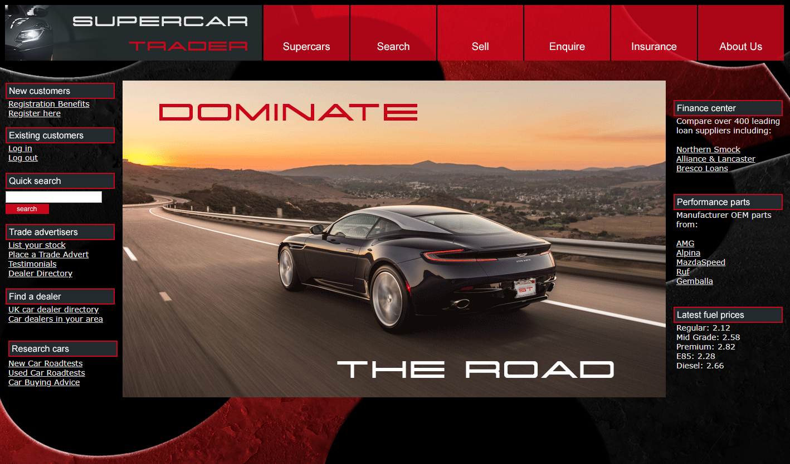
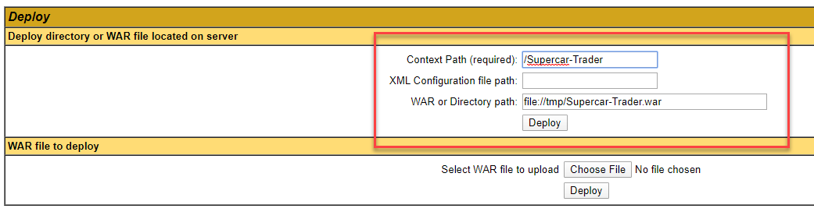

# Supercar Trader Readme

This is a simple Struts application which provides for an online supercar store which has some performance/code issues. The application can be built with Maven.

## Architecture

The application is based on a Struts front end, using a [MySQL](https://www.mysql.com) back end.  MySql 5.7 is recommended.

## Database

The app uses a MySQL DB in the backend, the default schema is expected to be the "supercars" schema, and MySQL running on the same host as the application. The database build scripts are in "src/main/resources/db"

There are three scripts you will need to run in order:

- mysql-01.sql
- mysql-02.sql
- mysql-03.sql

The datasouce is defined in context.xml in src/webapp/META-INF

## Building

This app uses [Maven](https://maven.apache.org) for the build. To get a build environment working:

1. Have [Git](https://git-scm.com) installed and working
1. Get [Maven](https://maven.apache.org) installed
	- Get the tar.gz or zip package from the Maven site
	- Unpack somewhere on your file system, e.g. "/opt/maven/apache-maven-3.3.9/"
	- Add the Maven bin directory to your path, e.g. in "vi .bash_profile" add:
		<pre><code>
 		export M2_HOME=/opt/maven/apache-maven-3.3.9
 		export M2=$M2_HOME/bin
 		export PATH=$PATH:$M2
 		</code></pre>
	- Login and out of your shell to get the new path
	- Test using the command "mvn". This should run Maven and indicate "Build Failure"
1. Use Git to obtain the source code
	<pre><code>
 	git clone https://github.com/Appdynamics/DevNet-Labs.git
 	</code></pre>
1. Change to the /applications/Supercar-Trader directory and then execute the following for the build
	<pre><code>
	mvn install
	</code></pre>
1. This should run and leave "Supercar-Trader.war" in the "target/" directory

1. Now configure a user for the Tomcat Manager. In "$TOMCAT_HOME/conf/tomcat-users.xml" add a line line the following:
	<pre><code>
 	&lt;user username="user" password="pass" roles="manager-script,manager-gui"/&gt;
	</code></pre>
1. Restart Tomcat
1. Use the Tomcat Manager to deploy the war file
   
   You can either upload the war file through the Tomcat Manager web page or copy the war file to your Tomcat host and and enter the context path and path to the war file as in the example below
   
    
1. Now the app is available on "/Supercar-Trader/home.do" on your Tomcat instance
	
