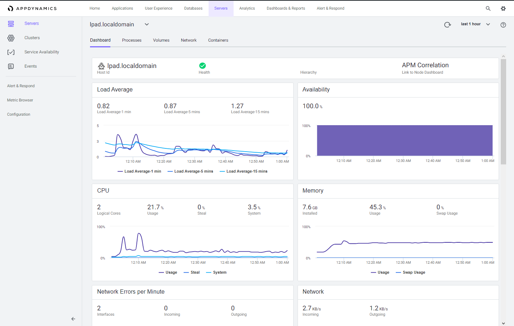

 Server Visibility Monitoring - 101
=========================================================================

## Objectives

In this Lab you learn about AppDynamics Server Visibility Monitoring and Service Availability Monitoring.  You'll learn how they give you extended hardware metrics and enable you to quickly see underlying infrastructure issues impacting your application performance. This means you can rapidly troubleshoot hardware performance problems that are impacting your applications.

## Prerequisites

You should already have access to the virtual machines for the lab.  If do not already have access to the VMs for the lab, follow the instructions [here](../101-00-appd-vm-setup/lab-exercise-01.md).

  
- You will need to use the same two virtual machines you used in the [Java Application Monitoring 101 Lab](../101-01-appd-apm-java/lab-exercise-01.md)
- This Lab has dependencies associated with the [Java Application Monitoring 101 Lab](../101-01-appd-apm-java/lab-exercise-01.md)
- Please complete the [Java Application Monitoring 101 Lab](../101-01-appd-apm-java/lab-exercise-01.md) before you proceed with this Lab if you have not already done so.

## Lab Contents
This lab covers six main areas:

1. Check the lab prerequisites 
2. Download the AppDynamics Server Visibility Agent
3. Install the AppDynamics Server Visibility Agent
4. Monitor Server Health
5. Monitor Service Availability

## Lab Virtual Machines

The lab environment has two virtual machines.  The first virtual machine hosts the AppDynamics Controller and will be referred to from this point on as the "Controller VM".  

The second virtual machine hosts the Supercar Trader application used in the labs.  It will be the host where you will install the AppDynamics agents and will be referred to from this point on as the "Application VM".

**NOTE:** These will be the same two virtual machines you used in the [Java Application Monitoring 101 Lab](../101-01-appd-apm-java/lab-exercise-01.md).

 

### Controller VM

 

### Application VM

 

If you are ready to learn how AppDynamics can help you monitor the health of your applications host and services, let's get started!   

 

[Lab setup](../101-00-appd-vm-setup/lab-exercise-01.md) | 1, [2](lab-exercise-02.md), [3](lab-exercise-03.md), [4](lab-exercise-04.md), [5](lab-exercise-05.md), [6](lab-exercise-06.md) | [Back](../101-00-appd-vm-setup/lab-exercise-01.md) | [Next](lab-exercise-02.md)
