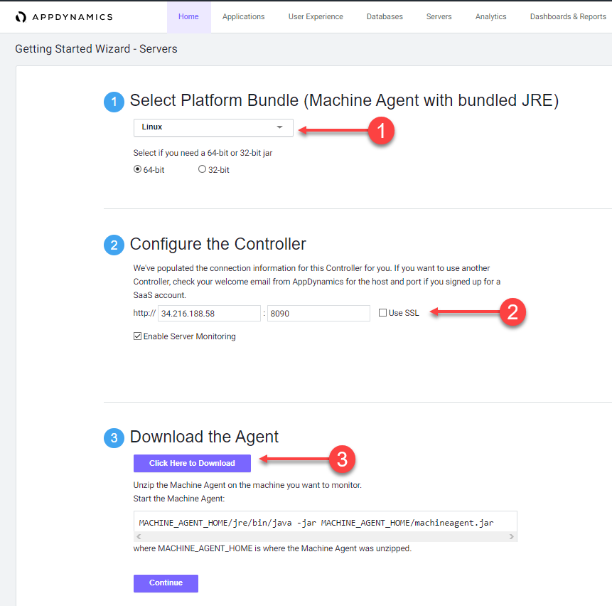
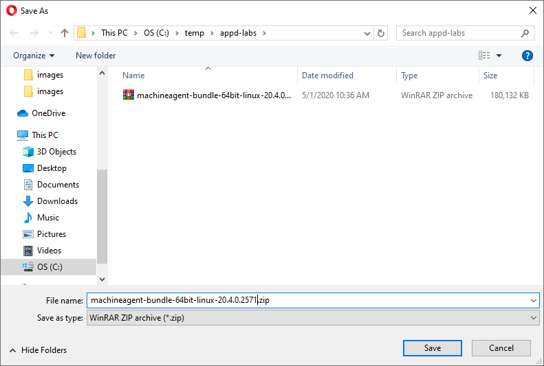

 Download the Server Visibility Agent from the Controller
=========================================================================

In this exercise you will access your AppDynamics Controller from your web browser and download the Server Visibility agent from there.  

In the example URL below, substitute the IP Address or fully qualified domain name of your Controller VM. 

Example Controller URL for browser:

```
http://IP_OR_FQDN_OF_HOST:8090/controller
```

### **1.** Access the controller login screen from your web browser
You should see the login page of the Controller like the image below.


Use the case sensative credentials below to login:

- Username = admin 
- Password = welcome1

<br>

### **2.** Navigate to the Getting Started Wizard

1. Click on the "Home" tab at the top left of the screen
2. Click on the "Getting Started" tab
3. Click on the "Getting Started Wizard" button

<br>


<br>

### **3.** Select the Servers option

1. Click on the "Servers" button

<br>


<br>

### **4.** Download the Server Visibility Agent

1. Leave the Platform Bundle set to "Linux" and "64-bit"
2. Leave the defaults for the Controller connection as is
3. Click on the "Click Here to Download" button

<br>



<br>

### **5.** Save the Server Visibility Agent file to your file local system

Your browser should bring up a prompt for you to save the agent file to your local file system, similar to the image seen below (depending on your OS).

<br>



<br>

[Lab setup](../101-00-appd-vm-setup/lab-exercise-01.md) | [1](lab-exercise-01.md), [2](lab-exercise-02.md), 3, [4](lab-exercise-04.md), [5](lab-exercise-05.md), [6](lab-exercise-06.md) | [Back](lab-exercise-02.md) | [Next](lab-exercise-04.md)
