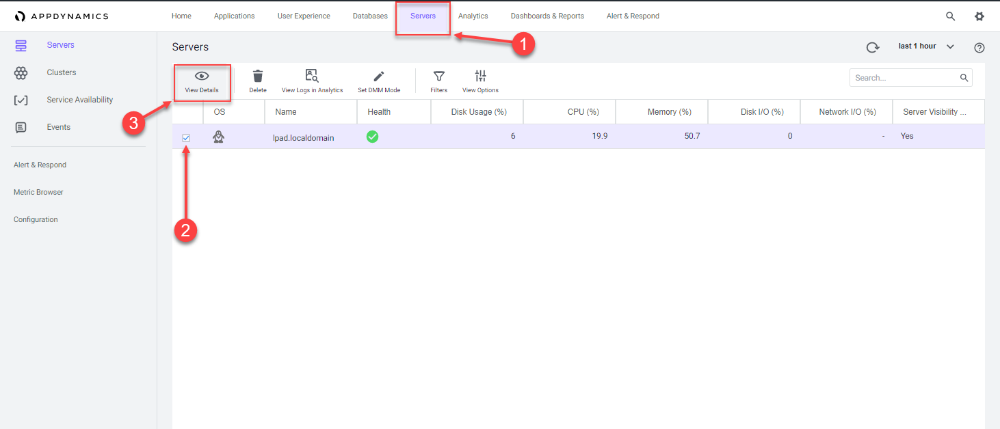
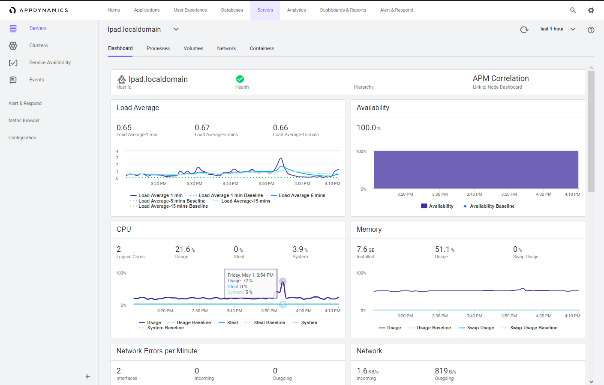
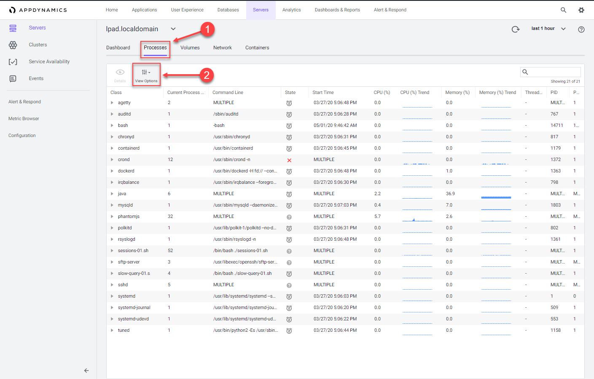
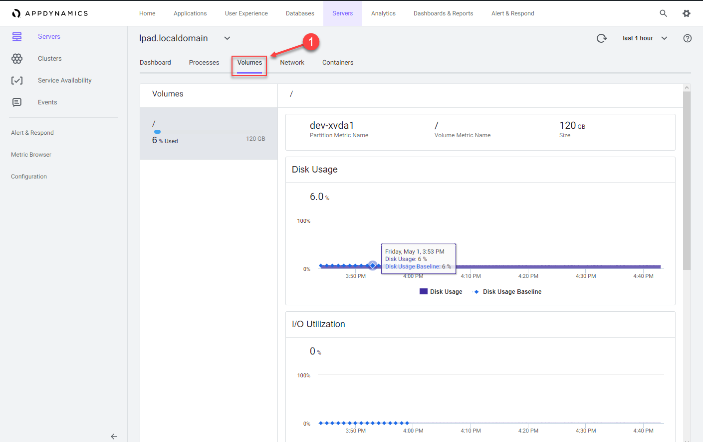
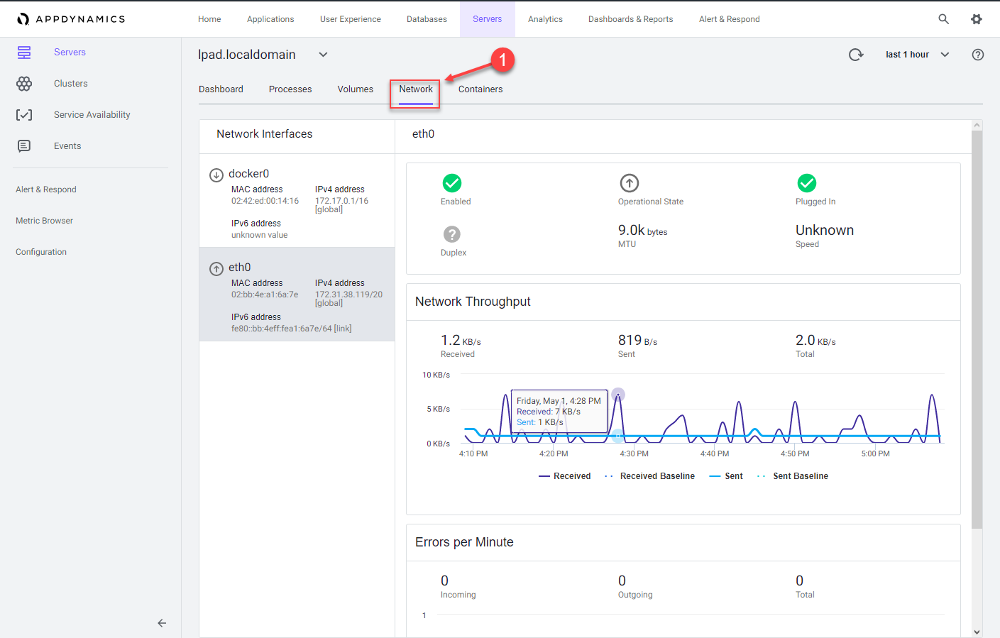
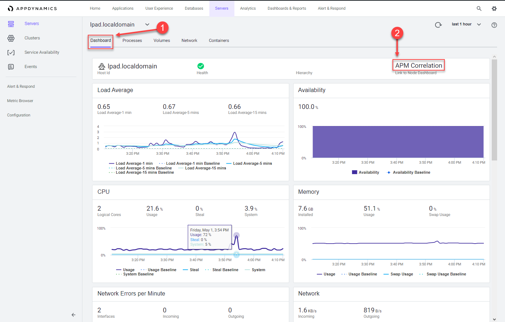
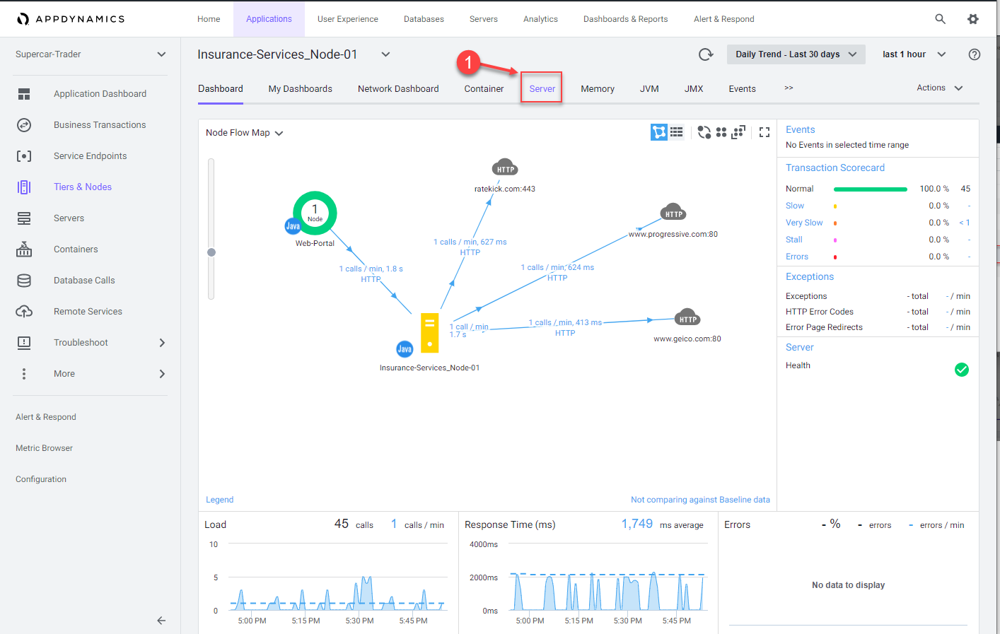
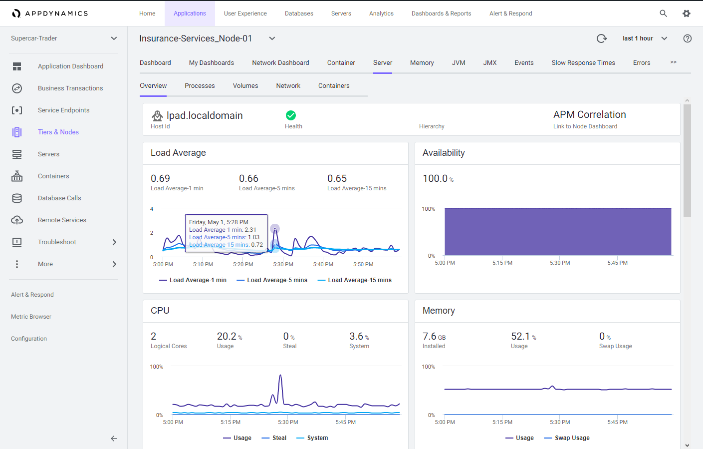

 Monitor Server Health
=========================================================================

In this exercise you will need to do the following:
- Review the Server Main Dashboard
- Review the Server Processes Dashboard
- Review the Server Volumes Dashboard
- Review the Server Network Dashboard
- Navigate between Server and Application Contexts

### **1.** Review the Server Main Dashboard

Now that you have the Server Visibility Monitoring agent installed, let's take a look at some of the features available in the Server Visibility module.

Navigate to the Servers list dashboard and drill into the servers main dashboard by following the steps below.

1. Click on the "Servers" tab on the top menu
2. Check the checkbox on the left for the first server
3. Click on the "View Details" button 

You can read more about the Servers List dashboard [here](https://docs.appdynamics.com/display/latest/Servers+List)

 

Explore the server main dashboard where you can:

- See charts of key performance metrics for the selected monitored servers, including server availability; 
  - CPU, memory, and network usage percentages 
  - server properties
  - disk, partition, and volume metrics
  - top 10 processes consuming CPU resources and memory
- Change the time period of the metrics displayed.
- See an assessment of the overall health of the server, as determined by whether any health rules have been violated. See 
View Health Rule Status in the UI 
- See the hierarchy or grouping of the server as specified in the controller-info.xml using the machine-path configuration property
- Click on any point on a chart to see the metric value for that time
- Find and switch to other Server Dashboards (pull-down menu next to server tier, top left)
- View an aggregate of the top 10 processes by CPU usage, and top 10 processes by memory

You can read more about the Server Main dashboard [here](https://docs.appdynamics.com/display/latest/Server+Dashboard)

 

### **2.** Review the Server Processes Dashboard

1. Click on the "Processes" tab
2. Click on the "View Options" button to select different data columns

Explore the server processes dashboard where you can:

- View all the processes active during the selected time period. The processes are grouped by class as specified in the [ServerMonitoring.yml](https://docs.appdynamics.com/display/latest/Machine+Agent+Settings+for+Server+Visibility) file
- View the full command line that started this process by hovering over the process entry in the Command Line column
- Expand a process class to see the processes associated with that class
- Use View Options to configure which columns to display in the chart
- Change the time period of the metrics displayed
- Sort the chart using the columns as a sorting key. You can not sort on sparkline charts: CPU Trend and Memory Trend
- See CPU and Memory usage trends at a glance

You can read more about the Server Processes dashboard [here](https://docs.appdynamics.com/display/latest/Server+Process+Metrics)

 

### **3.** Review the Server Volumes Dashboard

1. Click on the "Volumes" tab
   
Explore the server volumes dashboard where you can:

- See in the list of volumes, the percentage used and total storage space available on the disk, partition or volume
- See disk usage and I/O utilization, rate, operations per second, and wait time
- Change the time period of the metrics collected and displayed
- Click on any point on a chart to see the metric value for that time
  

You can read more about the Server Volumes dashboard [here](https://docs.appdynamics.com/display/latest/Server+Volumes+Metrics)

 

### **4.** Review the Server Network Dashboard

1. Click on the "Network" tab
   
Explore the server network dashboard where you can:

- See the MAC, IPv4, and IPv6 address for each network interface.
- See whether or not the network interface is enabled, functional, its operational state equipped with an ethernet cable that is plugged in, operating in full or half-full duplex mode, maximum transmission unit (MTU) or size (in bytes) of the largest protocol data unit that the network interface can pass, speed of the ethernet connection in Mbit/sec
- View network throughput in kilobytes/sec and packet traffic.
- Change the time period of the metrics displayed.
- Hover over on any point on a chart to see the metric value for that time.
  

You can read more about the Server Network dashboard [here](https://docs.appdynamics.com/display/latest/Server+Network+Metrics)

 

### **5.** Navigate between Server and Application Contexts

The Server Visibility Monitoring agent automatically associates itself with any AppDynamics APM agents running on the same host.

With Server Visibility enabled, you can access server performance metrics in the context of your applications.    You can switch between server and application contexts in different ways.  Follow the steps below to navigate from the server main dashboard to one of the Nodes running on the server.

1. Click on the "Dashboard" tab
2. Click on the "APM Correlation" link
   

 

Follow the next steps below.

1. Click the down arrow on one of the listed Tiers
2. Click on the Node of the Tier
3. Click on the "Details" button

 

You are now on the main Node dashboard.

1. Click on the "Server" tab to see the related host metrics

 

When you have the Server Visibility Monitoring agent installed, the host metrics are always available within the context of the related Node.

You can read more about navigating between Server and Application Contexts [here](https://docs.appdynamics.com/display/PRO45/Navigating+Between+Server+and+Application+Contexts)

 

[Lab setup](../101-00-appd-vm-setup/lab-exercise-01.md) | [1](lab-exercise-01.md), [2](lab-exercise-02.md), [3](lab-exercise-03.md), [4](lab-exercise-04.md), 5, [6](lab-exercise-06.md) | [Back](lab-exercise-04.md) | [Next](lab-exercise-06.md)

