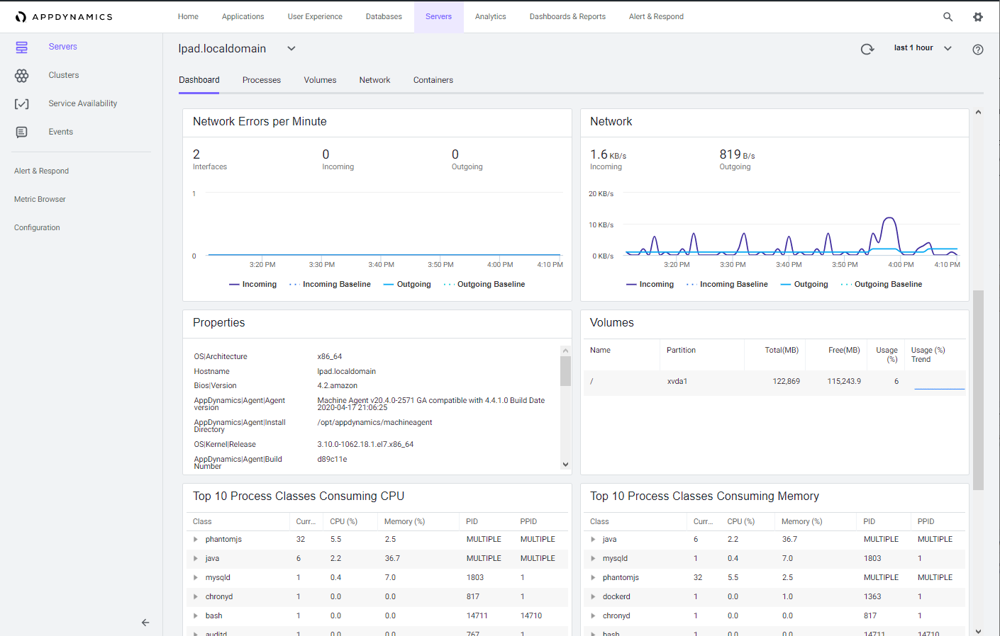

 Monitor Server Health
=========================================================================

In this exercise you will need to do the following:
- Review the Server Main Dashboard
- Review the Server Processes Dashboard
- Review the Server Volumes Dashboard
- Review the Server Network Dashboard

### **1.** Review the Server Main Dashboard

Now that you have the Server Visibility Monitoring agent installed, let's take a look at some of the features available in the Server Visibility module.

Navigate to the Servers list dashboard and drill into the servers main dashboard by following the steps below.

1. Click on the "Servers" tab on the top menu
2. Check the checkbox on the left for the first server
3. Click on the "View Details" button 

 

Explore the server main dashboard where you can:

- See charts of key performance metrics for the selected monitored servers, including server availability; 
  - CPU, memory, and network usage percentages 
  - server properties
  - disk, partition, and volume metrics
  - top 10 processes consuming CPU resources and memory
- Change the time period of the metrics displayed.
- See an assessment of the overall health of the server, as determined by whether any health rules have been violated. See 
View Health Rule Status in the UI. 
- See the hierarchy or grouping of the server as specified in the controller-info.xml using the machine-path configuration property.
- Click on any point on a chart to see the metric value for that time.
- Find and switch to other Server Dashboards (pull-down menu next to server tier, top left).
- View an aggregate of the top 10 processes by CPU usage, and top 10 processes by memory.

 

### **2.** Review the Server Processes Dashboard

Explore the server processes dashboard.

1. Click on the "Processes" tab
2. Click on the "View Options" button to select different data columns

 

 

 

[Lab setup](../101-00-appd-vm-setup/lab-exercise-01.md) | [1](lab-exercise-01.md), [2](lab-exercise-02.md), [3](lab-exercise-03.md), [4](lab-exercise-04.md), 5, [6](lab-exercise-06.md), [7](lab-exercise-07.md) | [Back](lab-exercise-04.md) | [Next](lab-exercise-06.md)

