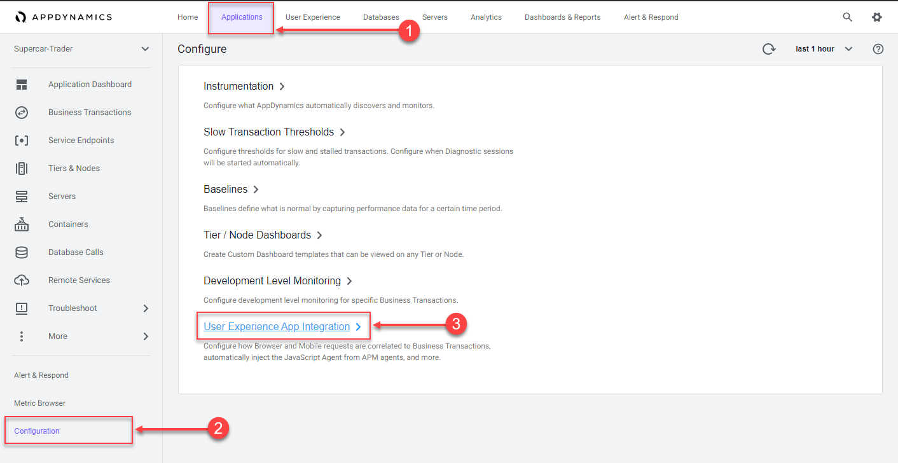
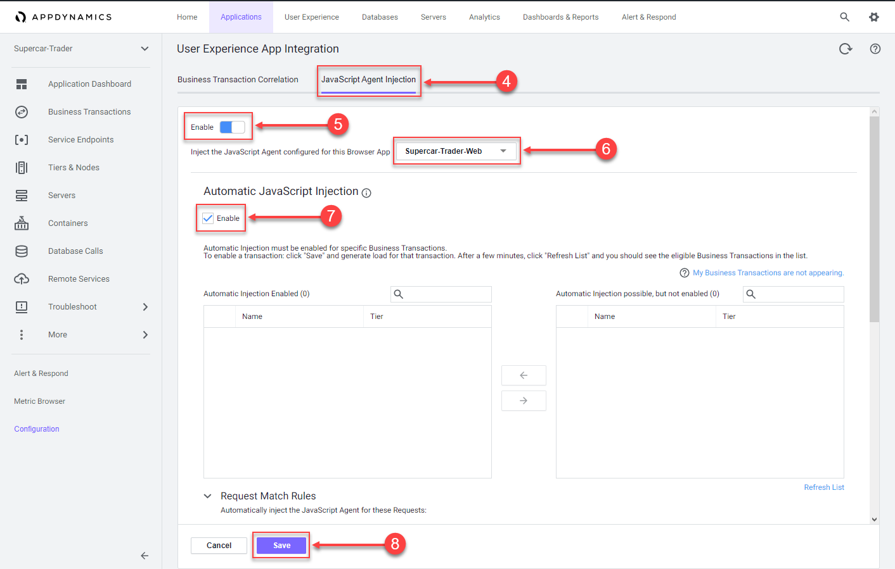
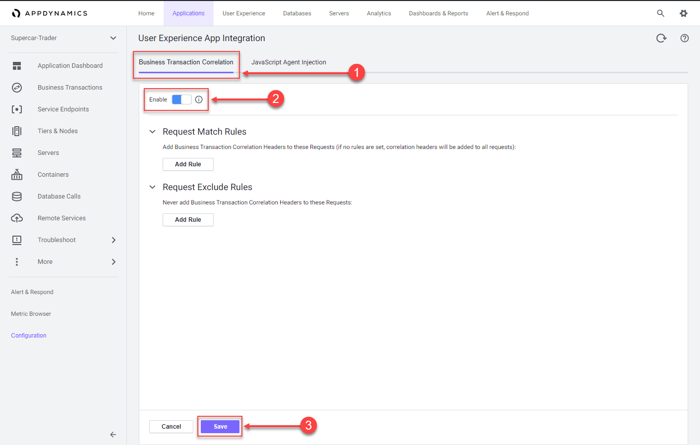
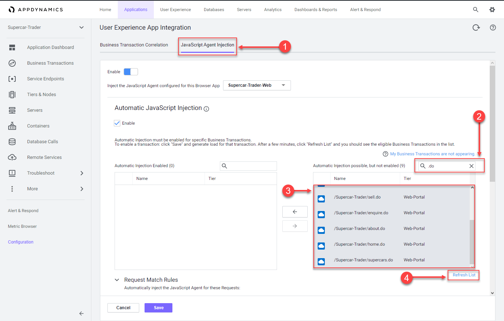
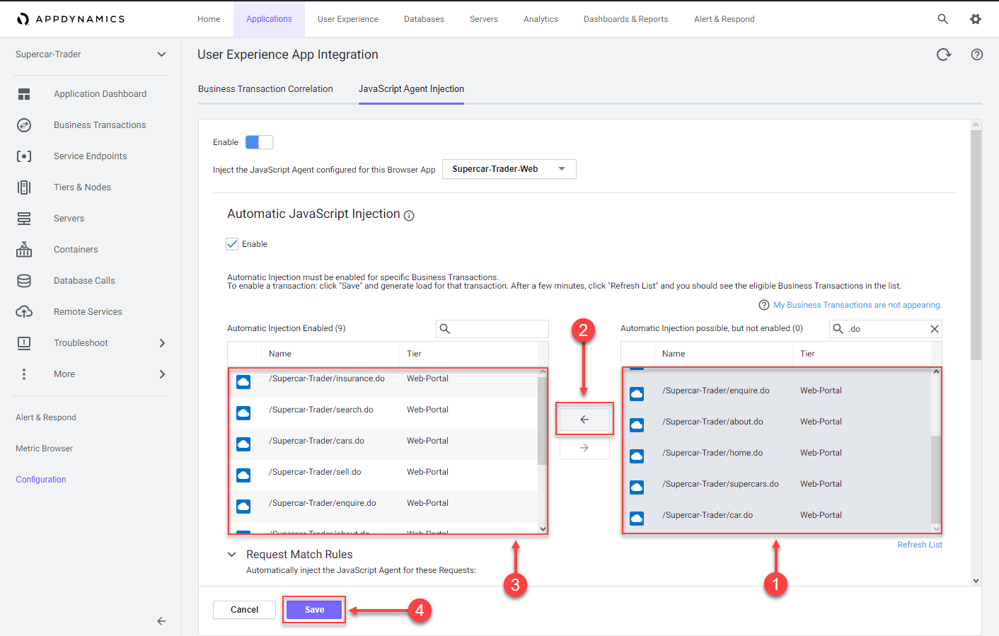

 Configure the browser agent injection settings
=========================================================================

In this exercise you will need to do the following:

- Enable JavaScript Agent injection
- Select Business Transactions for injection

### **1.** Enable JavaScript Agent injection

While AppDynamics supports various methods for injecting the JavaScript Agent, you will be using the Auto-Injection method in this lab.  Follow the steps below to enable the Auto-Injection of the JavaScipt Agent.

1. Click on the "Applications" tab on the top menu and drill into the Supercar-Trader application
2. Click on the "Configuration" tab on the left menu at the bottom
3. Click on the "User Experience App Integration" option

 

4. Click on the "JavaScript Agent Injection" tab
5. Click the "Enable"button so that it turns blue
6. Ensure that "Supercar-Trader-Web" is the browser app selected
7. Check the "Enable" check box under "Enable JavaScript Injection"
8. Click on the "Save" button

 

It takes a few minutes for the Auto-Injection to discover potential Business Transactions.  While this is happening, use the steps below to enable the Business Transaction Correlation.

1. Click on the "Business Transaction Correlation" tab
2. Click the "Enable"button so that it turns blue
3. Click on the "Save" button

 

### **2.** Select Business Transactions for injection

Use the following steps to select the Business Transactions for Auto-Injection.

1. Click on the "JavaScript Agent Injection" tab
2. Type .do in the search box
3. Ensure there are nine Business Transactions in the list box on the left
4. If all nine Business Transactions do not appear in the list, click the "Refresh List" link until all nine appear

 

Use the following steps to move the Business Transactions for Auto-Injection.

1. Select all nine Business Transactions from the right list box
2. Click on the arrow button to move them to the left list box
3. Ensure there are nine Business Transactions in the left list box
4. Click on the "Save" button

You can read more about configuring Automatic Injection of the JavaScript Agent [here](https://docs.appdynamics.com/display/latest/Automatic+Injection+of+the+JavaScript+Agent)

 

[Lab setup](../101-00-appd-vm-setup/lab-exercise-01.md) | [1](lab-exercise-01.md), [2](lab-exercise-02.md), [3](lab-exercise-03.md), 4, [5](lab-exercise-05.md), [6](lab-exercise-06.md), [7](lab-exercise-07.md) | [Back](lab-exercise-03.md) | [Next](lab-exercise-05.md)
