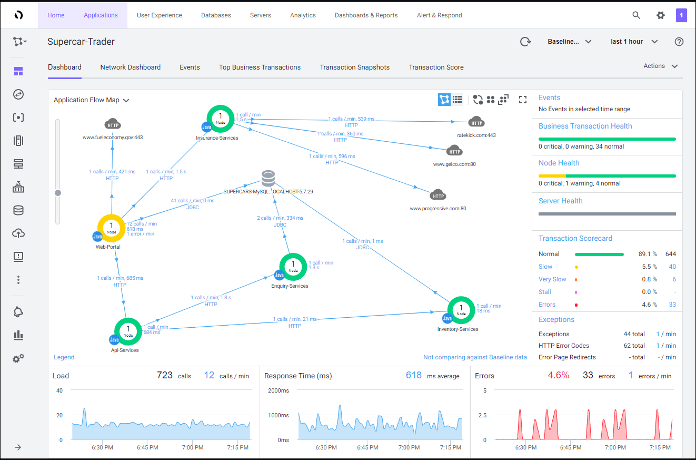

# Get started with AppDynamics Java application monitoring

## Objectives

In this Lab you learn how to use AppDynamics to monitor the health of your application services. In this Lab, you learn how to install and configure the Java Application Performance Monitoring (APM) agent to monitor your application's health, how to troubleshoot application performance issues to find root cause, and how to monitor alerts in AppDynamic's monitoring service based off of data captured by AppDynamics.

## Prerequisites

You should already have VPN access to your Sandbox environment for the lab.  If you have not requested a Sandbox environment for the lab, follow the instructions [here](../appd-sandbox-setup-101/1.md).  You should have basic experience with Java and Linux.

## Lab Contents
This lab covers six main areas:

1. Download the AppDynamics Java APM Agent
2. Install the AppDynamics Java APM Agent
3. Initialize the sample application with load
4. Configure collection settings in the Controller
5. Monitor and troubleshoot application issues : Part 1
6. Monitor and troubleshoot application issues : Part 2

## Sandbox Virtual Machines

The sandbox environment for the labs has two virtual machines.  The first virtual machine hosts the AppDynamics Controller and will be referred to from this point on as the "Controller VM".  

The second virtual machine hosts the Supercar Trader application used in the labs.  It will be the host where you will install the AppDynamics agents and will be referred to from this point on as the "Application VM".
 
<br>

### Controller VM:


<br>

### Application VM:


<br>

If you are ready to learn how AppDynamics can help you monitor your application's health, let's get started!

<br>

[Lab setup](../appd-sandbox-setup-101/1.md) | 1, [2](2.md), [3](3.md), [4](4.md), [5](5.md), [6](6.md), [7](7.md) | [Back](../appd-sandbox-setup-101/1.md) | [Next](2.md)

```diff
-TODO:  
Remove menu before moving to staging.
```