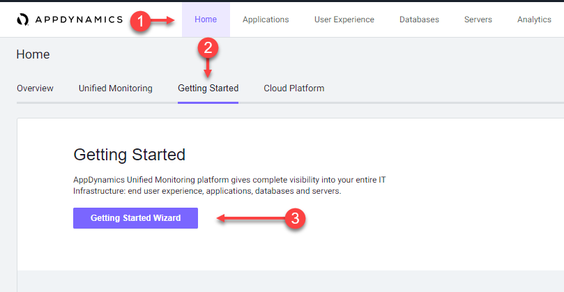
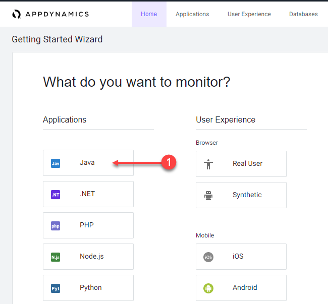
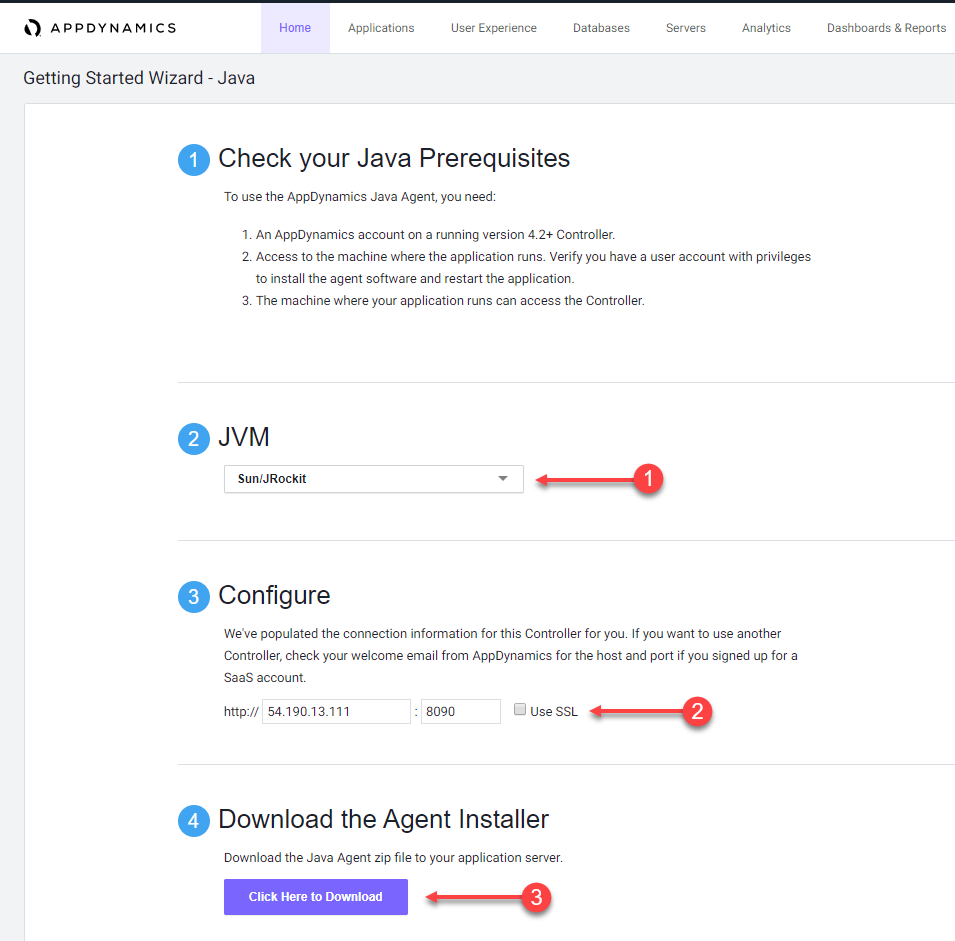
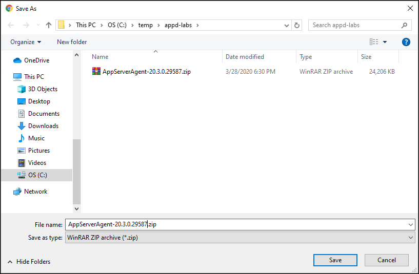

# Download the AppDynamics Java APM Agent from the Controller

In this exercise you will access your AppDynamics Controller from your web browser and download the Java APM agent from there.  

<span style="color: red;">TODO:</span> <span style="color: blue;">Add reference to VPN connection requirement [here](../appd-sandbox-setup-101/1.md)</span>


In the example URL below, substitute the IP Address or fully qualified domain name of your Controller VM which you received in an email after reserving your sandbox environment for the labs. 

Example Controller URL for browser:

```
http://IP_OR_FQDN_OF_HOST:8090/controller
```

### **1.** Access the controller login screen from your web browser
You should see the login page of the Controller like the image below.


Use the case sensative credentials below to login:

- Username = admin 
- Password = welcome1

<br>

### **2.** Navigate to the Getting Started Wizard

1. Click on the "Home" tab at the top left of the screen
2. Click on the "Getting Started" tab
3. Click on the "Getting Started Wizard" button

<br>



<br>

### **3.** Select the Java Application type

1. Click on the "Java" button

<br>



<br>

### **4.** Download the Java Agent

1. Leave the JVM type set to "Sun/JRockit"
2. Leave the defaults for the Controller connection as is
3. Click on the "Click Here to Download" button

<br>



<br>

### **5.** Save the Java Agent file to your file local system

Your browser should bring up a prompt for you to save the agent file to your local file system, similar to the image seen below (depending on your OS).

<br>


<br>

[Sandbox setup](../appd-sandbox-setup-101/1.md) | [1](1.md), 2, [3](3.md), [4](4.md), [5](5.md), [6](6.md), [7](7.md), [8](8.md) | [Back](1.md) | [Next](3.md)    &nbsp;&nbsp;&nbsp;&nbsp;&nbsp;&nbsp;<span style="color: red;">TODO:</span><span style="color: blue;">&nbsp;&nbsp;Remove menu before moving to staging</span>