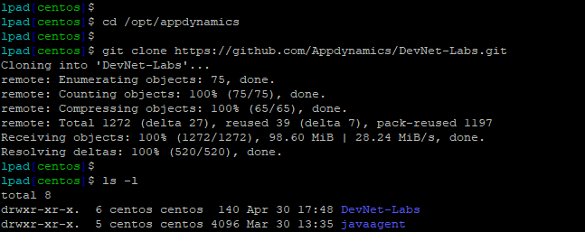
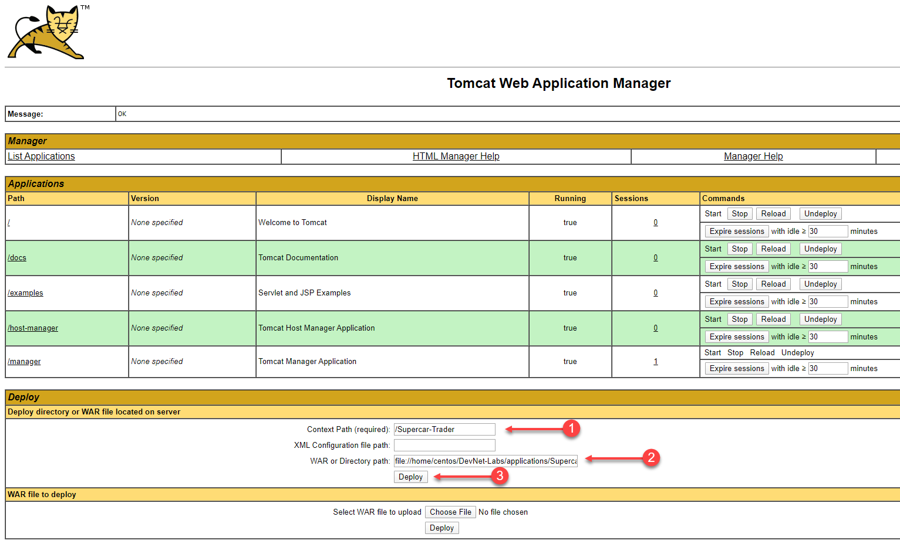
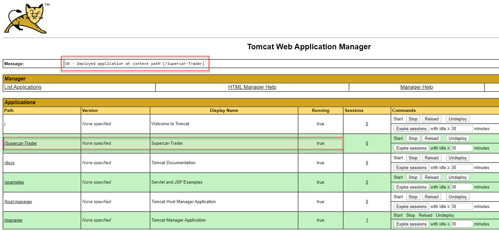
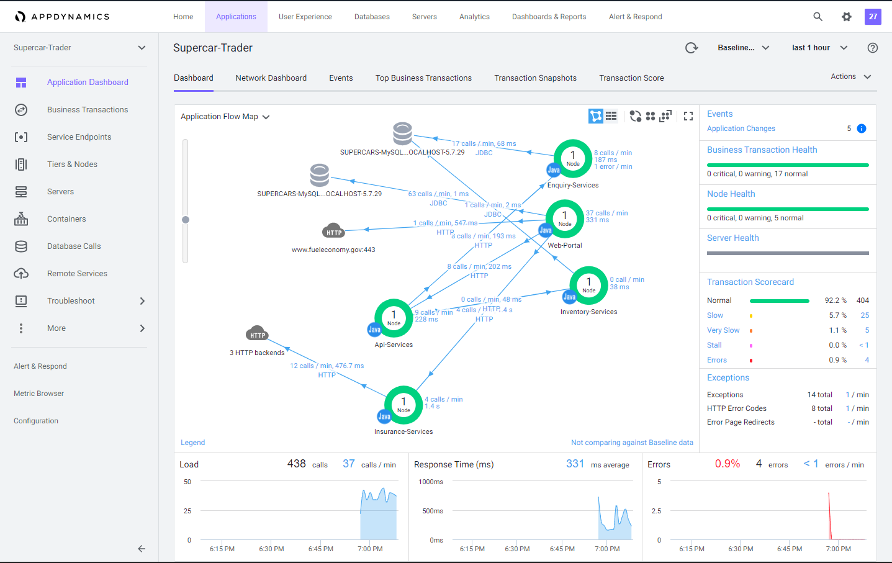
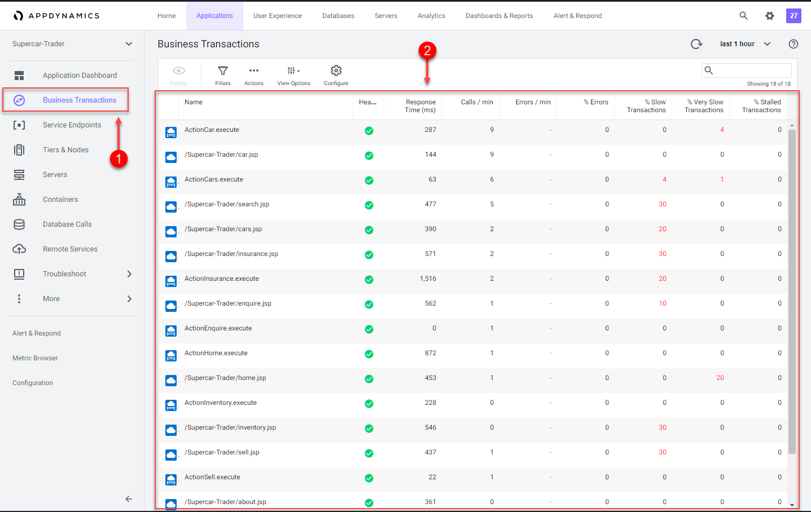

# Initialize the sample application with load

In this exercise you will need to do the following:
- Clone the GitHub lab repository on your "Application VM"
- Install the sample application on Apache Tomcat
- Start the load generation for the sample application
- Confirm the transaction load in the Controller


### **1.** Clone the GitHub lab repository on your "Application VM"

Use the commands below to clone the GitHub lab repository.

```
cd /home/centos

git clone https://github.com/Appdynamics/DevNet-Labs.git
```

```diff
-TODO:  
Change the GitHub URL above and the image below before moving to staging.
```

You should see output from the commands as seen below.



<br>

### **2.** Install the sample application on Apache Tomcat

Use the URL in the example below to open the Apache Tomcat landing page in your browser.  In the example URL below, substitute the IP Address of your "Application VM". 

Example Tomcat URL for browser:

```
http://IP_OF_APPLICATION_VM:8080
```

You should see the Tomcat landing page as seen below.  

1. Click on the "Manager App" button.  

You will be prompted to enter a username and password.  Use the case sensative credentials below to login to the Tomcat Manager App.

- Username = admin 
- Password = welcome1

<br>


<br>

You should now see the Tomcat Manager App page as seen in the image below.  Follow the steps below to deploy the sample application into Tomcat.  

1. Enter the value below in the "Context Path (required):" field
```
/Supercar-Trader
```
2. Enter the value below in the "WAR or Directory path::" field
```
file://home/centos/DevNet-Labs/applications/Supercar-Trader/Supercar-Trader.war
```
3. Click on the "Deploy" button

```diff
-TODO:  
Change the path to the WAR file above and the screenshot with the path shown below before moving to staging.
```
<br>



<br>

Once the deployment is completed, you should see the application running as seen in the image below.



<br>

Navigate the the home page of the sample application with your web browser using the example URL seen below.  In the example URL below, substitute the IP Address of your "Application VM". 

Example Application URL for browser:

```
http://IP_OF_APPLICATION_VM:8080/Supercar-Trader/home.do
```
You should see the home page like the image below.


<br>


### **3.** Start the load generation for the sample application

Initiate the transaction load for the application using the commands below.

```
sudo chmod 754 /home/centos/DevNet-Labs/applications/Load-Generator/phantomjs/*.sh

cd /home/centos/DevNet-Labs/applications/Load-Generator/phantomjs

./start_load.sh
```

```diff
-TODO:  
Change the path to the load script directory above before moving to staging.
```


You should see output from the commands as seen below.


<br>

### **4.** Confirm the transaction load in the Controller

Use your web browser to access the AppDynamics Controller.

Login to the Controller and you should see the "Supercar-Trader" application like the image below.

1. Double click on the "Supercar-Trader" application to open the application flow map.


<br>

When you open the flow map for the application, you should see all the application components appear after ten minutes like you see in the image below.  

If you don't see all the application components after ten minutes, try refreshing your browser tab.



<br>
Once all of the components appear on the flow map, you should see an "HTTP" cloud icon that represents the three HTTP backends called by the "Insurance-Services" Tier.  

Ungroup the the three HTTP backends by following the steps below.

1. Right click on the HTTP cloud icon labeled "3 HTTP backends"
2. From the drop down menu, select "Ungroup Backends"


<br>

Once the HTTP backends have been ungrouped, you should see all three HTTP backends as seen in the image below.


<br>

Familiarize yourself with the some of the different features of the Flow Map.

1. Try using the different layout options
2. Try using the slider to adjust the zoom level
3. Look at the Transaction Scorecard 

You can read more about Flow Maps [here](https://docs.appdynamics.com/display/latest/Flow+Maps)


<br>

Verify that business transactions are being automatically detected by following the steps below.

1. Click on the "Business Transactions" option on the left menu
2. Look at the list of Business Transactions and their performance

You can read more about Business Transactions [here](https://docs.appdynamics.com/display/latest/Business+Transactions) and [here](https://docs.appdynamics.com/display/latest/Organize+Business+Transactions)



<br>


[Sandbox setup](../appd-sandbox-setup-101/1.md) | [1](1.md), [2](2.md), [3](3.md), 4, [5](5.md), [6](6.md), [7](7.md), [8](8.md) | [Back](3.md) | [Next](5.md)    

```diff
-TODO:  
Remove menu before moving to staging.
```
