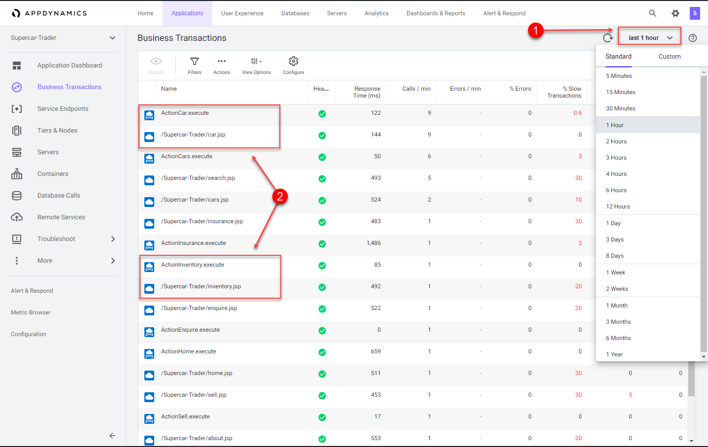
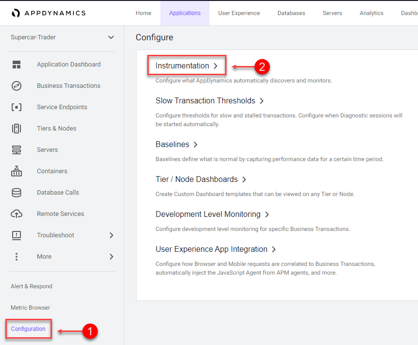
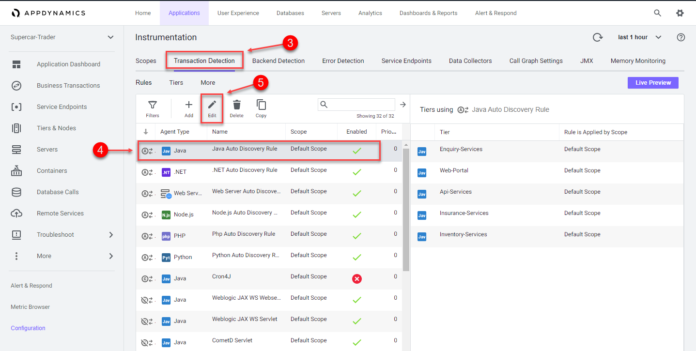
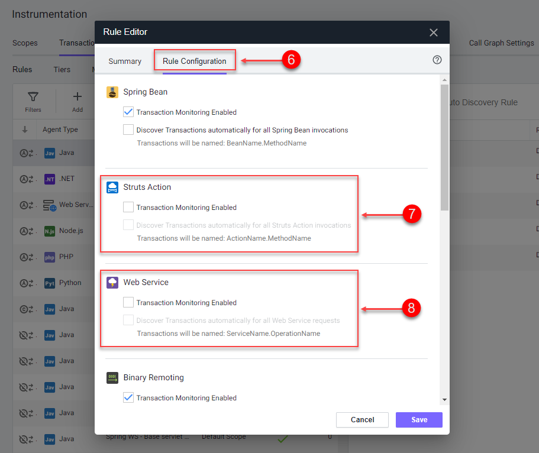
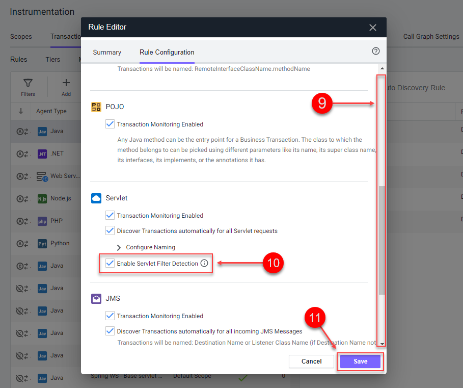
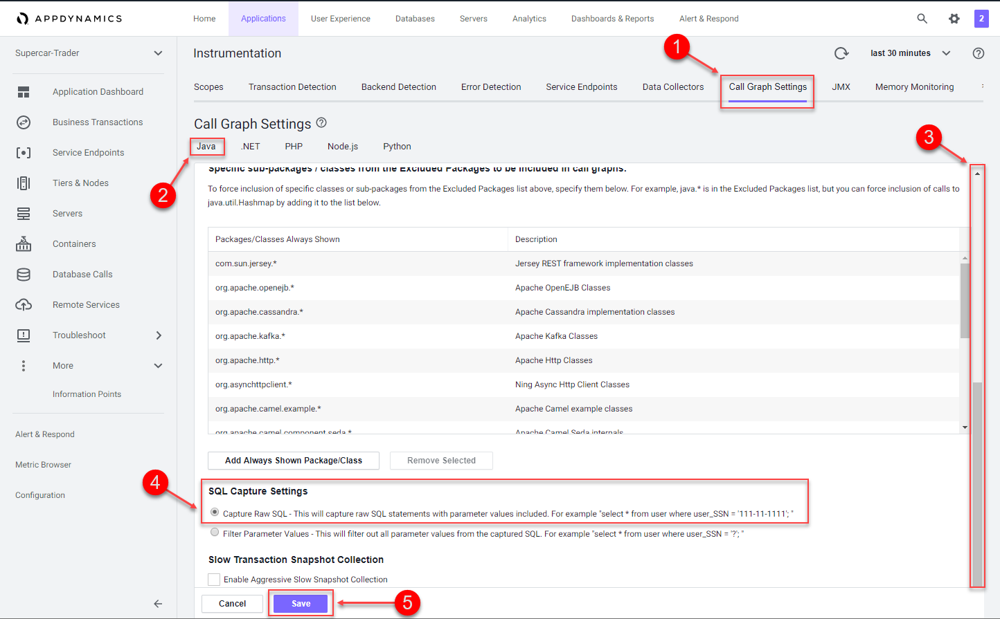
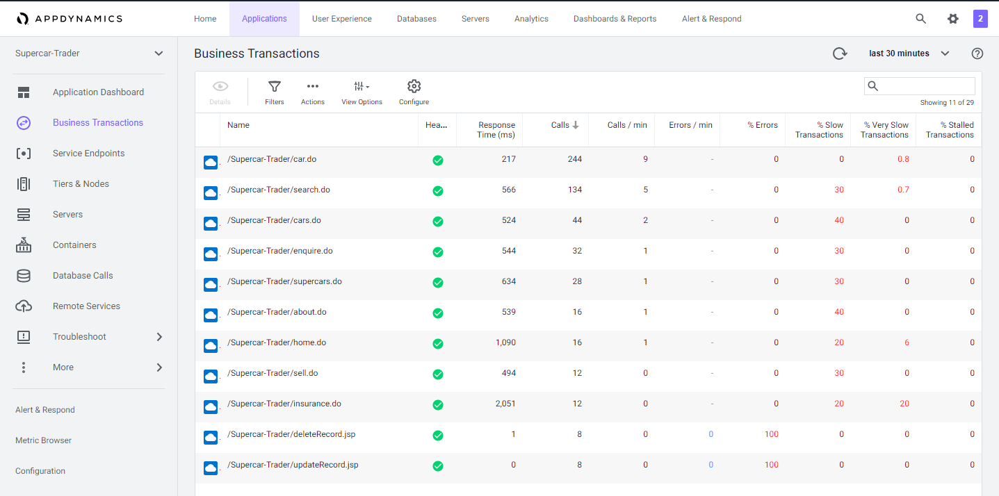

# Configure collection settings in the Controller

In this exercise you will need to do the following:
- Adjust Business Transaction auto-detection settings
- Adjust Call Graph settings
- Observe results of Business Transaction setting changes

### **1.** Adjust Business Transaction auto-detection settings

In the last exercise, you validated that the Business Transactions were being auto-detected.  There are times when you want to adjust the Business Transaction auto-detection rules to get them to an optimal state.  This is the case with our sample application which is built on an older Apache Struts framework.

The business transactions highlighted in the image below show that each pair has a Struts Action (.execute) and a Servlet type (.jsp).  You will be adjusting the settings of the transaction detection rules so that these two types of transactions will be combined into one.  

Anytime you see the time frame selector visible in the AppDynamics UI, the view you see will represent the context of the time frame selected.  You can choose one of the pre-defined time frames or create your own custom time frame with the specific date and time range you want to view.

1. Select the "last 1 hour" time frame
2. Use your mouse to hover over the blue icons to see the "Entry Point Type" of the transaction
 

 

Optimize the transaction detection by following the steps below.

1. Click on the "Configuration" option toward the bottom left menu
2. Click on the "Instrumentation" link

 

3. Select "Transaction Detection" from the "Instrumentation" menu
4. Select the "Java Auto Discovery Rule"
5. Click on the "Edit" button

 

6. Select the "Rule Configuration" tab on the Rule Editor
7. Uncheck all the boxes on the  "Struts Action"
8. Uncheck all the boxes on the  "Web Service"
9. Scroll down to find the "Servlet" settings
10. Check the box "Enable Servlet Filter Detection" (all three boxes should be checked on "Servlet" settings)
11. Click on the "Save" button to save your changes

You can read more about Transaction Detection Rules [here](https://docs.appdynamics.com/display/latest/Transaction+Detection+Rules)

 

### **2.** Adjust Call Graph settings

You can control the data captured in call graphs within transaction snapshots with the Call Graph Settings window seen below.  In this step you will change the SQL Capture settings so the parameters of each SQL query are captured along with the full query.  You can change the SQL Capture settings by following the steps below.

1. Select the "Call Graph Settings" tab from the Instrumentation window
2. Ensure you have the "Java" tab selected within the settings
3. Scroll down until you see the "SQL Capture Settings"
4. Click on the "Capture Raw SQL" option
5. Click on the "Save" button

You can read more about Call Graph settings [here](https://docs.appdynamics.com/display/latest/Call+Graph+Settings)

 

### **3.** Observe results of Business Transaction setting changes

It may take up to 30 minutes for the new business transactions to replace the prior transactions.  The list of business transactions should look like the one seen below after the new transactions are detected.

 

[//]: # (This syntax works like a comment, and won't appear in any output.)

<!-- This syntax works like a comment, and won't appear in any output. -->

[Lab setup](../appd-vm-setup-101/1.md) | [1](1.md), [2](2.md), [3](3.md), [4](4.md), 5, [6](6.md), [7](7.md) | [Back](4.md) | [Next](6.md)    

