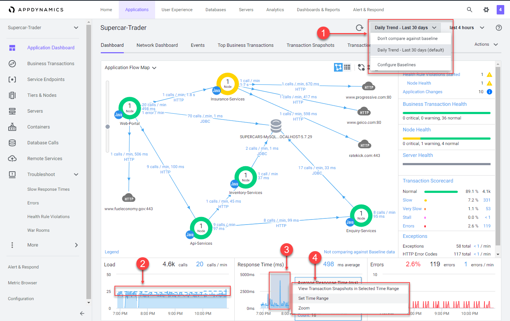

# Monitor and troubleshoot application issues

In this exercise you will need to do the following:
- Monitor the application dashboard and flow map
- Troubleshoot a slow transaction snapshot
- Find specific errors in the application
- Troubleshoot node issues


### **1.** Monitor the application dashboard and flow map

In the previous exercises we looked at some of the basic features of the Application Flow Map.  Let's take a deeper look at how we can use the Application Dashboard and Flow Map to immediately identify issues within the application.

1. Health Rule Violations, Node Health issues, and the health of the Business Transactions will always show up in this area for the time frame you have selected.  You can click on the links available here to drill down to the details.
2. The Transaction Scorecard shows you the number and percentage of transactions that are normal, slow, very slow, stalled, and have errors.  The scorecard also gives you the high level categories of exception types.  You can click on the links available here to drill down to the details.
3. Left-click (single-click) on any of the blue lines connecting the different application components to bring up an overview of the interactions between the two components.  
4. Left-click (single-click) within the colored ring of a Tier to bring up detailed information about that Tier while remaining on the Flow Map.
5. Hover over the time series on one of the three charts at the bottom of the dashboard (Load, Response Time, Errors) to see the detail of the recorded metrics.


<br>
Now let's take look at Dynamics Baselines and options for the charts at the bottom of the dashboard.


1. Compare the metrics on the charts to the Dynamic Baseline that has been automatically calculated for each of the metrics.
2. The Dynamic Baseline is shown in the load and response time charts as the blue dotted line seen in the image below. 
3. Left-click and hold down your mouse button while dragging from left to right to highlight a spike seen in any of the three charts at the bottom of the dashboard.  
4. Release your mouse button and select one of the three options in the pop-up menu.
   


<br>

The precision of AppDynamics unique Dynamic Baselining increases over time to provide you with an accurate picture of the state of your applications, their components, and their business transactions, so you can be proactively alerted before things get to a critical state and take action before your end users are impacted.

You can read more about AppDynamics Dynamic Baselines [here](https://docs.appdynamics.com/display/latest/Dynamic+Baselines)


<br>

### **2.** Troubleshoot a slow transaction snapshot

Let's look at our business transactions and find the one that has the highest number of very slow transactions by following the steps below.

1. Click on the "Business Transactions" option on the left menu
2. Click on the "View Options" button
3. Check and uncheck the boxes on the options to match what you see in the image below


<br>

Find the Business Transaction named "/Supercar-Trader/car.do" drill into the very slow transaction snapshots by performing the step below.

1. Click on the number of "Very Slow Transactions" for the "/Supercar-Trader/car.do" business transaction


<br>

You should see the list of very slow transaction snapshots as seen in the image below.  Double-click on the snapshot that has the highest response time as seen below.


<br>

Once you've opend the transaction snapshot, click on the "Drill Down" button on the Web-Portal Tier.


<br>

Continue here ....................


<br>


[Sandbox setup](../appd-sandbox-setup-101/1.md) | [1](1.md), [2](2.md), [3](3.md), [4](4.md), [5](5.md), 6, [7](7.md) | [Back](5.md) | [Next](7.md)    

```diff
-TODO:  
Remove menu before moving to staging.
```
