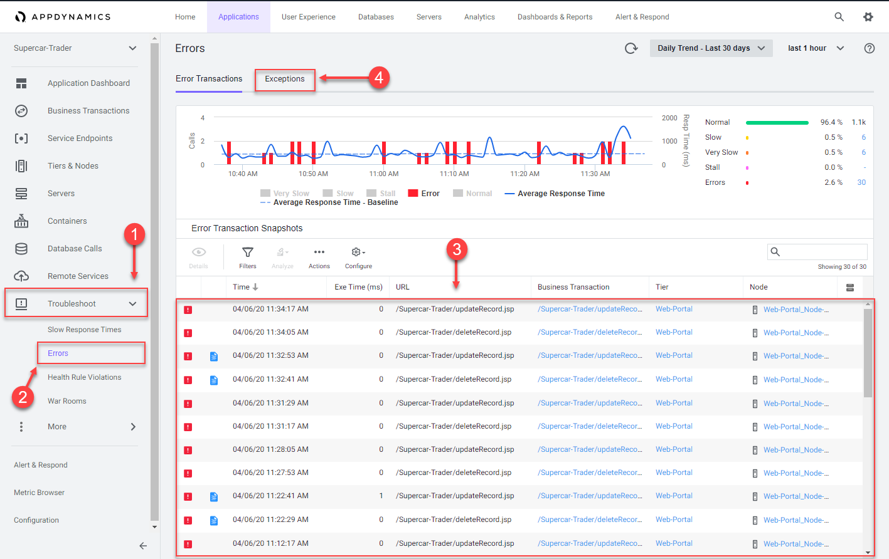

# Monitor and troubleshoot application issues : Part 2

In this exercise you will need to do the following:
- Find specific errors in the application
- Troubleshoot node issues

### **1.** Find specific errors in the application

AppDynamics makes it easy to find errors and exceptions within your application.  You can use the Errors dashboard to see transactions snapshots with errors and find the exceptions that are occurring most often by following the steps below.

1. Click on the "Troubleshoot" option on the left menu
2. Click on the "Errors" option on the left menu
3. Explore a few of the error transaction snapshots
4. Click on the "Exceptions" tab to see exceptions grouped by type

 

The Exceptions tab shows you what types of exceptions are occurring the most within the application so you can prioritize remediating the ones having the most impact.

At a glance you can see the name and summary for each exception type as well as:

1. The exceptions per minute
2. The total number of exceptions
3. The Tier where the exceptions are occurring
4. Double-click on the "MySQLIntegrityConstraintViolationException" type

 

The overview dashboard for the "MySQLIntegrityConstraintViolationException" type:

1. Defaults to the view showing you the list of snapshots where this type of exception has occurred
2. The tab labeled "Stack Traces for this Exception" shows you an aggregated list of the unique stack traces generated by this exception type
3. Double-click on one of the snapshots for the exception to open the snapshot

 

When you open an error snapshot from the exceptions screen, the snapshot opens to the specific segment within the snapshot where the error occurred.

1. When an exit call has an error or exception it will be shown in red text
2. Drilling into the exit call shows you the details of the error or exception
3. To see the full stack trace of the exception, click on the "Error Details" at the top right

You can read more about Errors and Exceptions [here](https://docs.appdynamics.com/display/latest/Errors+and+Exceptions)

 

### **2.** Troubleshoot node issues

AppDynamics provides visual indicators throughout the UI making it easy to recognize issues and understand where they are.  The Application Dashboard shows there is a problem with a Node in the "Insurance-Services" Tier.

You can see indicators of Node issues in three areas on the Application Dashboard.

1. The Tier icon on the Flow Map changes color to indicate an issue with the Tier or one of its Nodes
2. The Events panel shows Health Rule Violations, including those related to Node Health
3. The Node Health panel tells you how many critical or warning issues are occurring for Nodes

Click on the "Node Health" link in the Node Health panel to drill into the "Tiers & Nodes" dashboard.

 

You can see the list of all the Nodes and find the Node that's having an issue with the steps below.

1. Click on the "Grid View" button
2. Click on the warning icon for the "Insurance-Services_Node-01" Node

 

The Health Rule Violations summary viewer shows all the violations for the Node within the context of the time frame you are viewing.  In this case there is only one violation.

1. Click on the violation description
2. Click on the "Details" button to see the details

 

The Health Rule Violation details viewer shows you:

1. The current state of the violation
2. The timeline of when the violation was occurring
3. The specifics of what the violation is and the conditions that triggered it
4. Click on the "View Dashboard During Health Rule Violation" button

 

When you click on the "View Dashboard During Health Rule Violation" button, it takes you to the "Server" tab of the Node dashboard by default.

If you haven't installed the AppDynamics Server Monitoring agent yet then you won't see the resource metrics for the host of the Node.  The AppDynamics Java agent collects memory metrics from the JVM.  Investigate the JVM heap data following the steps below.

1. Click on the "Memory" tab
2. Look at the current heap utilization
3. Notice the Major Garbage Collections that have been occurring

 

4. Use the outer scroll bar to scroll to the bottom of the screen
5. Notice that the "PS Old Gen" memory space is at 100%

You can read more about Errors and Exceptions [here](https://docs.appdynamics.com/display/latest/Troubleshoot+Node+Problems) and [here](https://docs.appdynamics.com/display/latest/Monitor+JVMs)

 

[Lab setup](../appd-vm-setup-101/1.md) | [1](1.md), [2](2.md), [3](3.md), [4](4.md), [5](5.md), [6](6.md), 7 | [Back](6.md) | Next   
