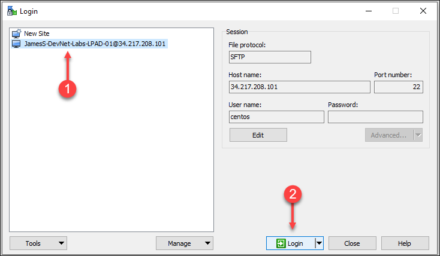
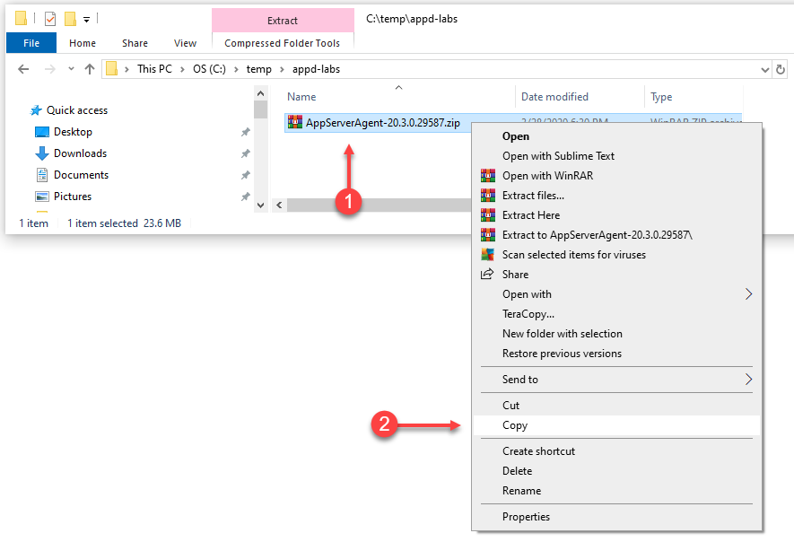
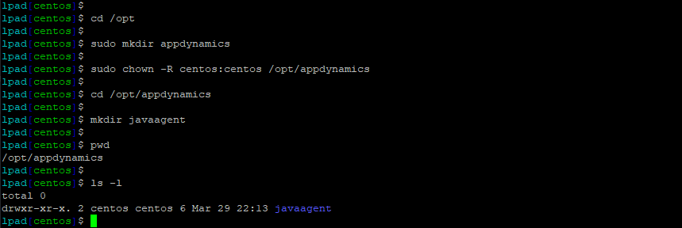
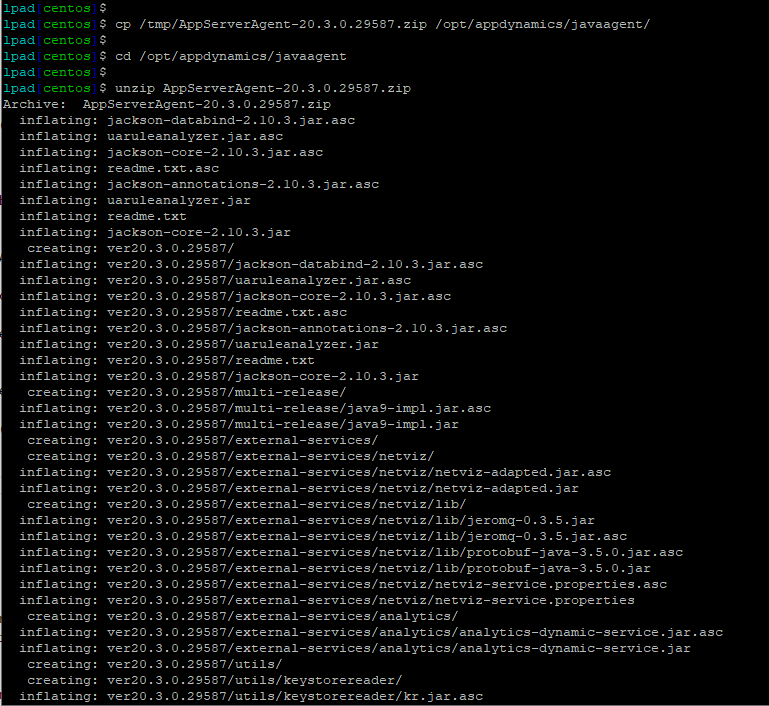
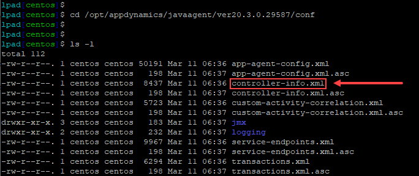
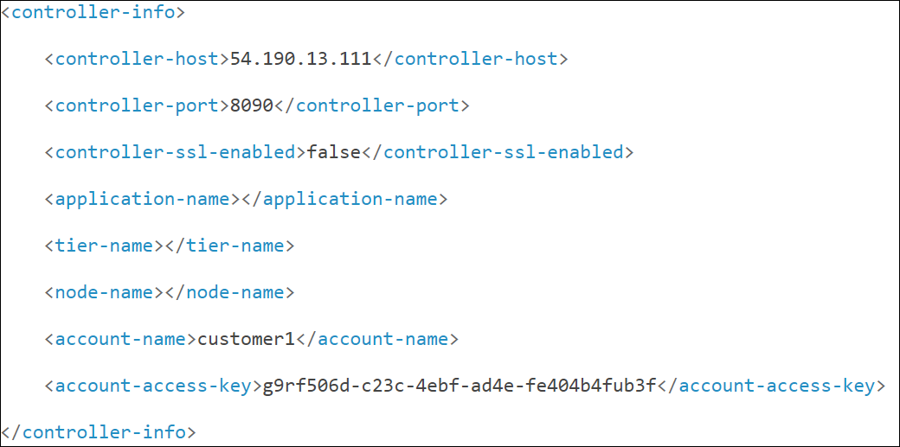
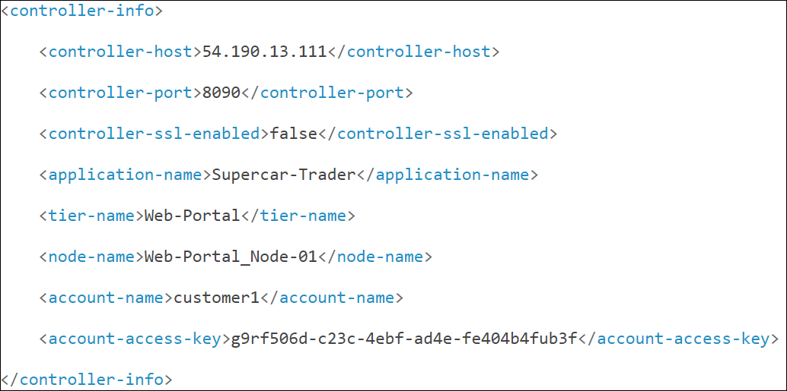
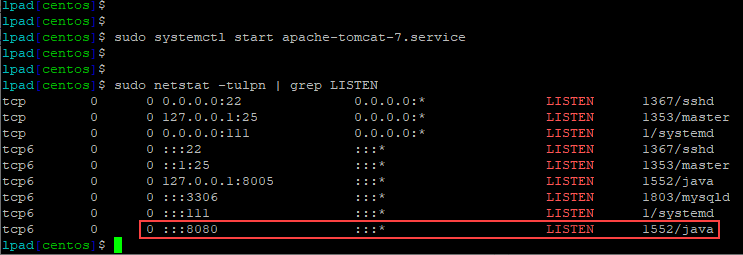

 Install the Java APM Agent
=========================================================================

In this exercise you will need to do the following:
- Upload the Java agent file to your "Application VM"
- Unzip the file into a specific directory on the file system
- Update the Java agents XML configuration file
- Modify the Apache Tomcat startup script to add the Java agent


You will need the following connection details for the "Application VM" during this exercise.

- IP Address
- Username
- Password

These were provided in the email you received after reserving your sandbox environment for the labs.

### **1.** Upload the Java agent file to your "Application VM"


***For Linux/Mac Users:***

You will need to adjust parts of the example upload command seen below since:

- It assumes that Java agent zip file you downloaded in the previous exercise is located in the "/tmp" directory of your local desktop
- The file name of your Java agent zip file may be slightly different than the one seen in the example below
- The "application.vm.ip.address" needs to be replaced with actual IP Address of the "Application VM"

Run the command below from a new terminal window to upload the Java agent zip file to the "/tmp" directory of the "Application VM".  

```bash
scp /tmp/AppServerAgent-20.3.0.29587.zip centos@application.vm.ip.address:/tmp/
```

```diff
-TODO:  
Add screenshot of upload here.
```

Executing the command will prompt you for the password for the "Application VM".  Enter the password to complete the command.

<br>

You will need to adjust parts of the example SSH command seen below since:
- The "application.vm.ip.address" needs to be replaced with actual IP Address of the "Application VM"

Open a new terminal window and use the command below to SSH into your "Application VM"

```
ssh centos@application.vm.ip.address
```

```diff
-TODO:  
Add screenshot of SSH window here.
```

Executing the command will prompt you for the password for the "Application VM".  Enter the password to complete the command.

<br>

***For Windows Users:***

You will need [WinSCP](https://winscp.net/download/WinSCP-5.17.2-Setup.exe) or another SCP client installed to upload the Java agent zip file to the "Application VM".  WinSCP also includes the SSH client [PuTTY](https://www.putty.org/).
<br>

Add a new site in WinSCP for your "Application VM" using the steps below:

1. Enter the IP Address for your "Application VM"
2. Enter the Username for your "Application VM"
3. Enter the Password for your "Application VM"
4. Click the "Save" button


<br>

Login to your "Application VM" using the steps below:

1. Click on the new site you created for your "Application VM"
2. Click on the "Login" button



<br>

Navigate to the "/tmp" directory and select "Binary" for Transfer Settings.


<br>

Copy the Java agent zip file using the steps below:

1. Navigate to the directory where you downloaded the file
2. Right click on the file and select "Copy"



<br>

Paste the Java agent zip file into the "/tmp" directory in the WinSCP window:

1. Right click on the right pane within WinSCP and select "Paste"


<br>

Open an SSH window to your "Application VM" using the steps below:

1. Click on the "New Session" tab
2. Click on the new site you created for your "Application VM"
3. Click on the arrow on the right side of the "Login" button and select "Open in PuTTY"


<br>

### **2.** Unzip the file into a specific directory on the file system

Use the commands below to create the directory structure where you will unzip the Java agent zip file.

```
cd /opt

sudo mkdir appdynamics

sudo chown -R centos:centos /opt/appdynamics

cd /opt/appdynamics

mkdir javaagent
```
You should now be able to see the new directory structure where the Java agent zip file will be copied to.



<br>

Use the commands below to copy the Java agent zip file to the directory and unzip the file.  The name of your Java agent file may be slightly different than the example below.

```
cp /tmp/AppServerAgent-20.3.0.29587.zip /opt/appdynamics/javaagent/

cd /opt/appdynamics/javaagent

unzip AppServerAgent-20.3.0.29587.zip
```
You should see the results of unzipping the file as in the image below.



<br>


### **3.** Update the Java agents XML configuration file

There are three primary ways to set the configuration properties of the Java agent.  These take precedence in the following order.

- System environment variables
- JVM properties passed on the command line
- Properties within the "controller-info.xml" file

In  this exercise you will be setting the Java agent configuration properties in the "controller-info.xml" file.


Find the "controller-info.xml" file of the Java agent.  The file is located in the directory seen below.

```
cd /opt/appdynamics/javaagent/verXX.X.X.XXXXX/conf
```

The name of the version directory for your Java agent may be slightly different than the example here.



There are over twenty properties with the "controller-info.xml" file. There are eight properties that typically need to be changed in the "controller-info.xml" file.

- controller-host
- controller-port
- controller-ssl-enabled
- application-name
- tier-name
- node-name
- account-name
- account-access-key

<br>




Five of those properties have been pre-populated by the Controller when you downloaded the agent from there.  You must update the remaining three.

- application-name
- tier-name
- node-name

Update the three properties in the file with the values seen below.  Ensure that you leave all other properties in the file defined as they are.  If you are using WinSCP to update the file, ensure that the "Transfer Settings" are set to "Text". 
```
<application-name>Supercar-Trader</application-name>
<tier-name>Web-Portal</tier-name>
<node-name>Web-Portal_Node-01</node-name>
```
Your file should look like the abbreviated example below after you have made the changes and saved the file. 



<br>

### **4.** Modify the Apache Tomcat startup script to add the Java agent

Apache Tomcat is installed and running on your "Application VM". Perform the steps below to add the Java agent to the Tomcat startup script.

Use the command below to stop the running instance of Apache Tomcat.

```bash
sudo systemctl stop apache-tomcat-7.service
```

Find the "catalina.sh" startup file for Apache Tomcat.  The file is located in the directory seen below.

```bash
cd /usr/local/apache/apache-tomcat-7/bin
```
Update the "catalina.sh" file and add the export command seen below right after line 111 in the file. 
If you are using WinSCP to update the file, ensure that the "Transfer Settings" are set to "Text".

```bash
export CATALINA_OPTS="$CATALINA_OPTS -javaagent:/opt/appdynamics/javaagent/javaagent.jar"
```


Your file should look like the abbreviated example below after you have made the changes and saved the file. 


Restart Apache Tomcat using the command below.

```bash
sudo systemctl start apache-tomcat-7.service
```
Wait for two minutes and use the command below to ensure Apache Tomcat is running on port 8080.

```bash
sudo netstat -tulpn | grep LISTEN
```
You should see output like the image below showing that port 8080 is in use by Apache Tomcat.



<br>

[Lab setup](../appd-vm-setup-101/lab-exercise-01.md) | [1](lab-exercise-01.md), [2](lab-exercise-02.md), 3, [4](lab-exercise-04.md), [5](lab-exercise-05.md), [6](lab-exercise-06.md), [7](lab-exercise-07.md) | [Back](lab-exercise-02.md) | [Next](lab-exercise-04.md)

