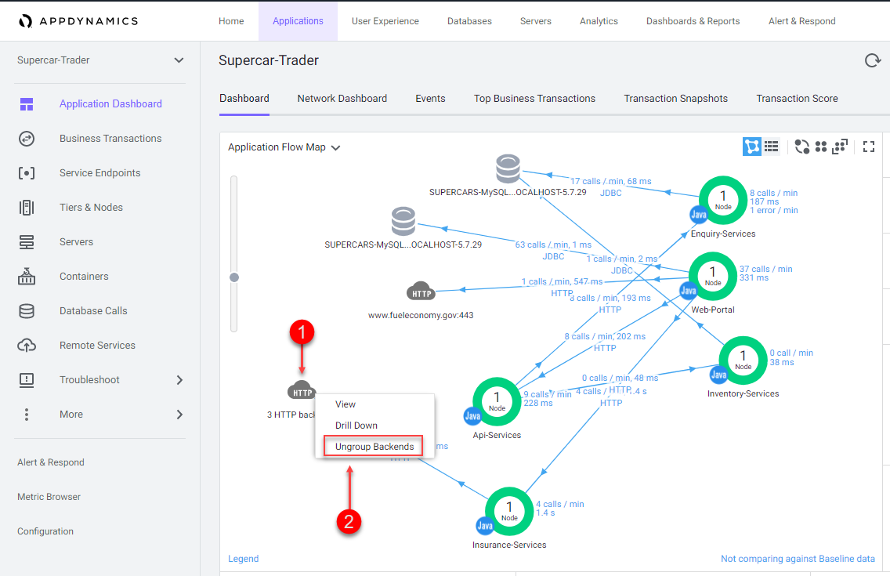
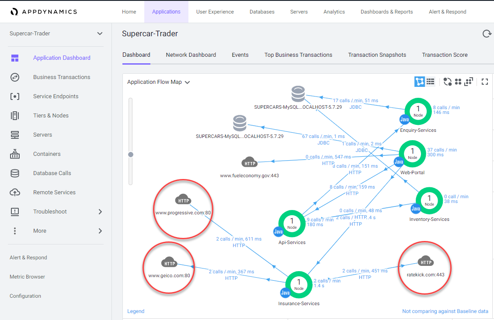
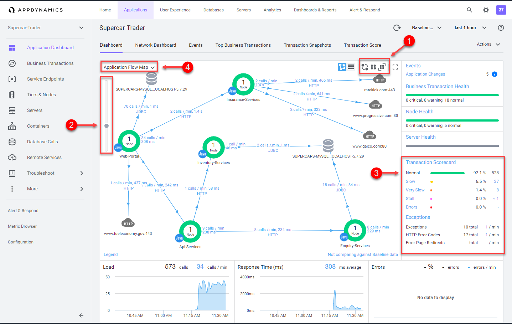

# Initialize the sample application with load

In this exercise you will need to do the following:
- Clone the GitHub lab repository on your "Application VM"
- Install the sample application on Apache Tomcat
- Start the load generation for the sample application
- Confirm the transaction load in the Controller


### **1.** Clone the GitHub lab repository on your "Application VM"

Use the commands below to clone the GitHub lab repository.

```
cd /home/centos

git clone https://github.com/Appdynamics/DevNet-Labs.git
```

You should see output from the commands as seen below.


<br>

### **2.** Install the sample application on Apache Tomcat

Use the URL in the example below to open the Apache Tomcat landing page in your browser.  In the example URL below, substitute the IP Address of your "Application VM". 

Example Tomcat URL for browser:

```
http://IP_OF_APPLICATION_VM:8080
```

You should see the Tomcat landing page as seen below.  

1. Click on the "Manager App" button.  

You will be prompted to enter a username and password.  Use the case sensative credentials below to login to the Tomcat Manager App.

- Username = admin 
- Password = welcome1

<br>


<br>

You should now see the Tomcat Manager App page as seen in the image below.  Follow the steps below to deploy the sample application into Tomcat.  

1. Enter the value below in the "Context Path (required):" field
```
/Supercar-Trader
```
2. Enter the value below in the "WAR or Directory path:" field
```
file://home/centos/DevNet-Labs/applications/Supercar-Trader/Supercar-Trader.war
```
3. Click on the "Deploy" button

<br>


<br>

Once the deployment is completed, you should see the application running as seen in the image below.


<br>

Navigate the the home page of the sample application with your web browser using the example URL seen below.  In the example URL below, substitute the IP Address of your "Application VM". 

Example Application URL for browser:

```
http://IP_OF_APPLICATION_VM:8080/Supercar-Trader/home.do
```
You should see the home page like the image below.


<br>


### **3.** Start the load generation for the sample application

Initiate the transaction load for the application using the commands below.

```
sudo chmod 754 /home/centos/DevNet-Labs/applications/Load-Generator/phantomjs/*.sh

cd /home/centos/DevNet-Labs/applications/Load-Generator/phantomjs

./start_load.sh
```


You should see output from the commands as seen below.


<br>

### **4.** Confirm the transaction load in the Controller

Use your web browser to access the AppDynamics Controller.

Login to the Controller and you should see the "Supercar-Trader" application like the image below.

1. Double-click on the "Supercar-Trader" application to open the application flow map.


<br>

When you open the flow map for the application, you should see all the application components appear after twelve minutes like you see in the image below.  

If you don't see all the application components after twelve minutes, try waiting a few more minutes and refresh your browser tab.


In the last exercise, you updated the "controller-info.xml" file to assign a Tier name and Node name to the Tomcat JVM.

```
<tier-name>Web-Portal</tier-name>
<node-name>Web-Portal_Node-01</node-name>
```

You might be wondering how the other four services had their Tier and Node name assigned.  The sample application dynamically creates four additional JVM's from the initial Tomcat JVM and assigns the Tier and Node names by passing those properties into the JVM startup command as "-D properties" for each of the four services.  Any "-D properties" included on the JVM startup command line will superceed the properties defined in the Java agents "controller-info.xml" file.

Issue the following command in your terminal window of your "Application VM" to see the JVM startup parameters used for each of the four services that were dynamically started.

```
ps -ef | grep appdynamics.agent.tierName
```

<br>

Once all of the components appear on the flow map, you should see an "HTTP" cloud icon that represents the three HTTP backends called by the "Insurance-Services" Tier.  


Ungroup the the three HTTP backends by following the steps below.

1. Right click on the HTTP cloud icon labeled "3 HTTP backends"
2. From the drop down menu, select "Ungroup Backends"



<br>

Once the HTTP backends have been ungrouped, you should see all three HTTP backends as seen in the image below.



<br>

AppDynamics app agents automatically discover the most common application frameworks and services. Using built-in application detection and configuration settings, agents collect application data and metrics to build flow maps.

AppDynamics automatically captures and scores every transaction. Flow maps present a dynamic visual representation of the components and activities of your monitored application environment in direct context of the time frame you have selected.

Familiarize yourself with the some of the different features of the Flow Map.

1. Try using the different layout options (you can also click and drag each icon on the flow map to position it)
2. Try using the slider to adjust the zoom level
3. Look at the Transaction Scorecard
4. Explore the options for editing the flow map

You can read more about Flow Maps [here](https://docs.appdynamics.com/display/latest/Flow+Maps)



<br>

In the AppDynamics model, a business transaction represents the data processing flow for a request, most often a user request. In real-world terms, many different components in your application may interact to provide services to fulfill the following types of requests:

- In an e-commerce application, a user logging in, searching for items or adding items to the cart
- In a content portal, a user requests content such as sports, business or entertainment news
- In a stock trading application, operations such as receiving a stock quote, buying or selling stocks

Because AppDynamics orients performance monitoring around business transactions, you can focus on the performance of your application components from the user perspective. You can quickly identify whether a component is readily available or if it is having performance issues. For instance, you can check whether users are able to log in, check out or view their data. You can see response times for users, and the causes of problems when they occur.

Verify that business transactions are being automatically detected by following the steps below.

1. Click on the "Business Transactions" option on the left menu
2. Look at the list of Business Transactions and their performance

You can read more about Business Transactions [here](https://docs.appdynamics.com/display/latest/Business+Transactions) and [here](https://docs.appdynamics.com/display/latest/Organize+Business+Transactions)


<br>

AppDynamics monitors every execution of a business transaction in the instrumented environment, and the metrics reflect all such executions. However, for troubleshooting purposes, AppDynamics takes snapshots (containing deep diagnostic information) of specific instances of transactions that are having problems. 

Verify that transaction snapshots are being automatically collected by following the steps below.

1. Click on the "Application Dashboard" option on the left menu
2. Click on the "Transaction Snapshots" tab
3. Click on the "Exe Time (ms)" column to sort the snapshots with the greatest execution time
4. Double-click a business transaction snapshot to display the snapshot viewer


<br>

A transaction snapshot gives you a cross-tier view of the processing flow for a single invocation of a transaction.

The "Potential Issues" panel highlights slow methods and slow remote service calls and help you investigate the root cause for performance issues. 

Call drill downs, detail key information including slowest methods, errors, and remote service calls for the transaction execution on a tier. A drill down may include a partial or complete call graph. Call graphs reflect the code-level view of the processing of the business transaction on a particular tier.

In the flow map for a business transaction snapshot, a tier with a Drill Down link indicates AppDynamics has taken a call graph for that tier.

Drill down into a call graph of the transaction snapshot by following the steps below.

1. Click on a slow call in the "Potential Issues" list on the left
2. Click on the "Drill Down into Call Graph" button
   


<br>

The call graph view shows you the following details.


1. The method execution sequence shows the names of the classes and methods that participated in processing the business transaction on this node, in the order in which the flow of control proceeded
2. For each method, you can see the time and percentage spent processing and the line number in the source code, enabling you to pinpoint the location in the code that could be affecting the performance of the transaction
3. The call graph displays exit call links for methods that make outbound calls to other components such as database queries and web service calls


You can read more about Transaction Snapshots [here](https://docs.appdynamics.com/display/latest/Transaction+Snapshots)

You can read more about Call Graphs [here](https://docs.appdynamics.com/display/latest/Call+Graphs)


<br>

Click [next](lab-exercise-05.md) to go to the next exercise.

[Lab setup](../appd-vm-setup-101/lab-exercise-01.md) | [1](lab-exercise-01.md), [2](lab-exercise-02.md), [3](lab-exercise-03.md), 4, [5](lab-exercise-05.md), [6](lab-exercise-06.md), [7](lab-exercise-07.md) | [Back](lab-exercise-03.md) | [Next](lab-exercise-05.md)    
