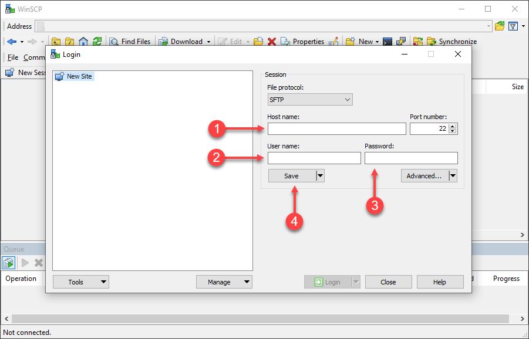
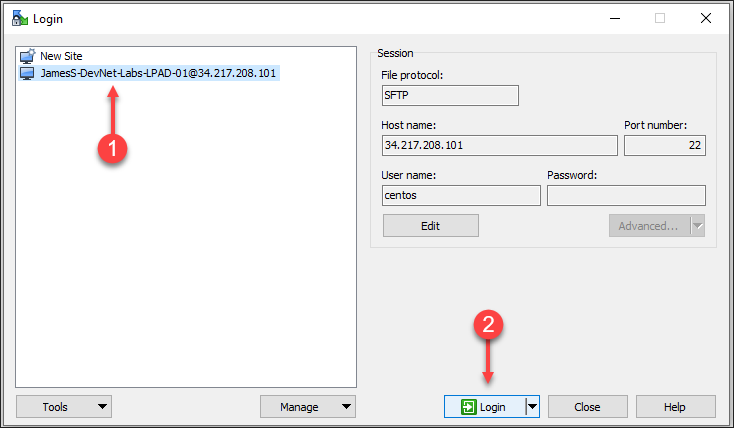
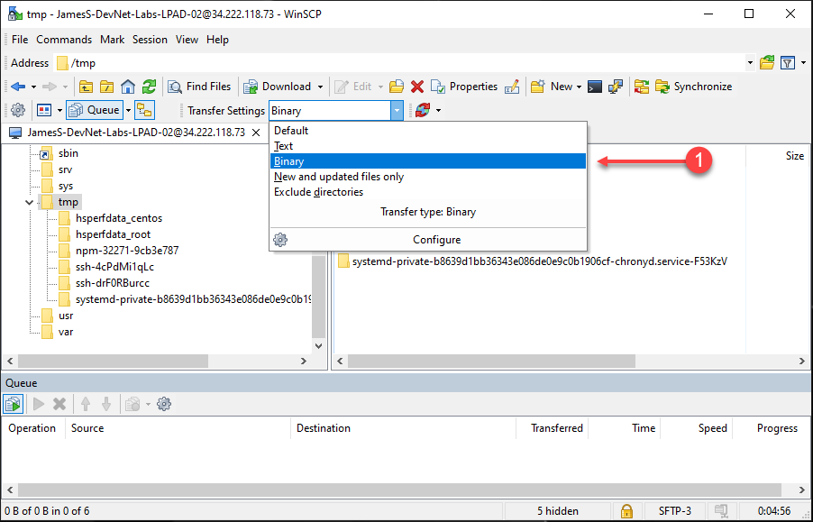
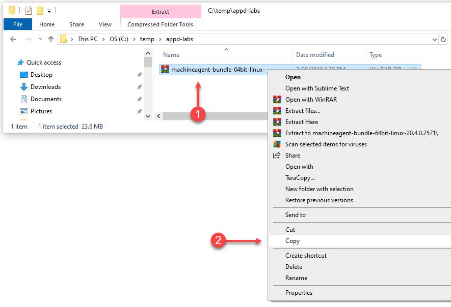
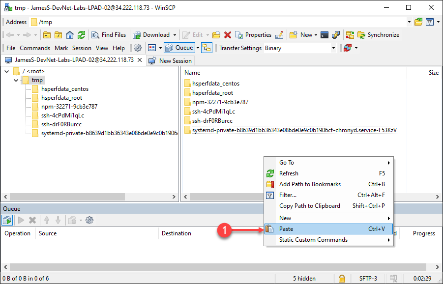
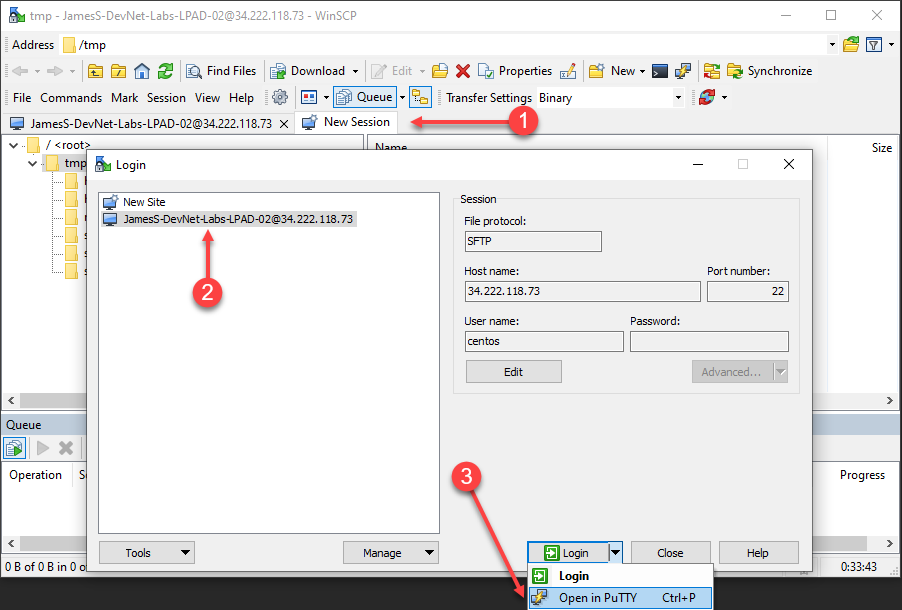
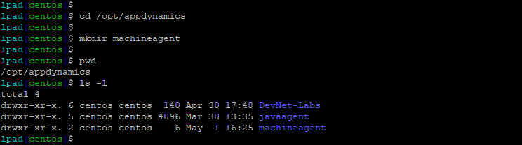
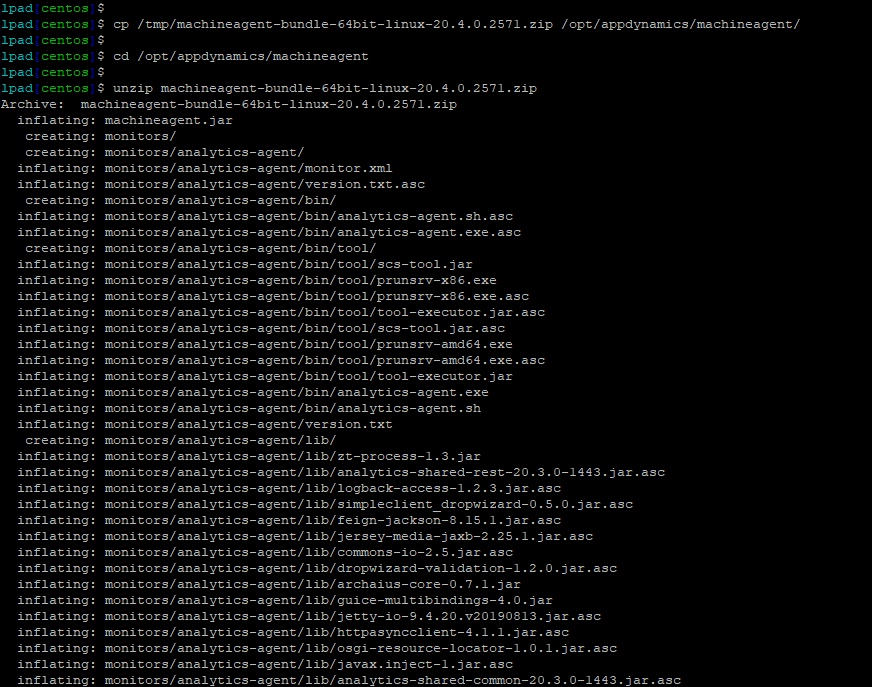
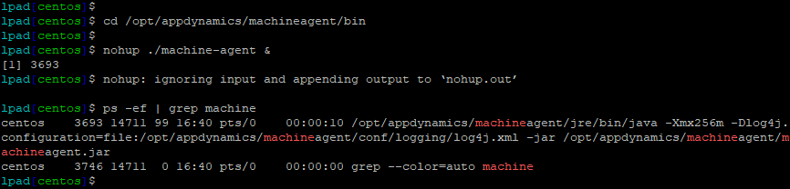

 Install the Server Visibility Agent
=========================================================================

In this exercise you will need to do the following:
- Upload the Server Visibility agent file to your "Application VM"
- Unzip the file into a specific directory on the file system
- Start the Server Visibility agent


You will need the following connection details for the "Application VM" during this exercise.

- IP Address
- Username
- Password

These were provided in the email you received after reserving your sandbox environment for the labs.

### **1.** Upload the Server Visibility agent file to your "Application VM"


***For Linux/Mac Users:***

You will need to adjust parts of the example upload command seen below since:

- It assumes that Server Visibility agent zip file you downloaded in the previous exercise is located in the "/tmp" directory of your local desktop
- The file name of your Server Visibility agent zip file may be slightly different than the one seen in the example below
- The "application.vm.ip.address" needs to be replaced with actual IP Address of the "Application VM"

Run the command below from a new terminal window to upload the Server Visibility agent zip file to the "/tmp" directory of the "Application VM".  

```bash
scp /tmp/machineagent-bundle-64bit-linux-20.4.0.2571.zip centos@application.vm.ip.address:/tmp/
```

Executing the command will prompt you for the password for the "Application VM".  Enter the password to complete the command.

<br>

You will need to adjust parts of the example SSH command seen below since:
- The "application.vm.ip.address" needs to be replaced with actual IP Address of the "Application VM"

Open a new terminal window and use the command below to SSH into your "Application VM"

```
ssh centos@application.vm.ip.address
```

Executing the command will prompt you for the password for the "Application VM".  Enter the password to complete the command.

<br>

***For Windows Users:***

You will need [WinSCP](https://winscp.net/download/WinSCP-5.17.2-Setup.exe) or another SCP client installed to upload the Java agent zip file to the "Application VM".  WinSCP also includes the SSH client [PuTTY](https://www.putty.org/).
<br>

Add a new site in WinSCP for your "Application VM" using the steps below:

1. Enter the IP Address for your "Application VM"
2. Enter the Username for your "Application VM"
3. Enter the Password for your "Application VM"
4. Click the "Save" button



<br>

Login to your "Application VM" using the steps below:

1. Click on the new site you created for your "Application VM"
2. Click on the "Login" button



<br>

Navigate to the "/tmp" directory and select "Binary" for Transfer Settings.



<br>

Copy the Server Visibility agent zip file using the steps below:

1. Navigate to the directory where you downloaded the file
2. Right click on the file and select "Copy"



<br>

Paste the Server Visibility agent zip file into the "/tmp" directory in the WinSCP window:

1. Right click on the right pane within WinSCP and select "Paste"



<br>

Open an SSH window to your "Application VM" using the steps below:

1. Click on the "New Session" tab
2. Click on the new site you created for your "Application VM"
3. Click on the arrow on the right side of the "Login" button and select "Open in PuTTY"




<br>

### **2.** Unzip the file into a specific directory on the file system

Use the commands below to create the directory structure where you will unzip the Server Visibility agent zip file.

```
su centos

cd /opt/appdynamics

mkdir machineagent
```
You should now be able to see the new directory structure where the Server Visibility agent zip file will be copied to.



<br>

Use the commands below to copy the Server Visibility agent zip file to the directory and unzip the file.  The name of your Server Visibility agent file may be slightly different than the example below.

```
cp /tmp/machineagent-bundle-64bit-linux-20.4.0.2571.zip /opt/appdynamics/machineagent/

cd /opt/appdynamics/machineagent

unzip machineagent-bundle-64bit-linux-20.4.0.2571.zip
```

You should see the results of unzipping the file as in the image below.



<br>


### **3.** Start the Server Visibility agent

Use the commands below to start the Server Visibility agent and verify that it started.

```
cd /opt/appdynamics/machineagent/bin

nohup ./machine-agent &

ps -ef | grep machine
```

You should see the results of starting the agent as in the image below.




<br>

[Lab setup](lab-exercise-00.md) | [1](lab-exercise-01.md), [2](lab-exercise-02.md), [3](lab-exercise-03.md), 4, [5](lab-exercise-05.md), [6](lab-exercise-06.md) | [Back](lab-exercise-03.md) | [Next](lab-exercise-05.md)

