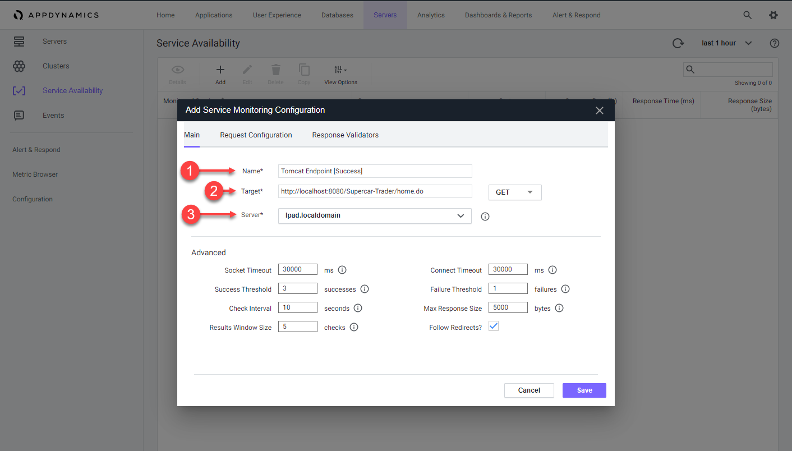

 Monitor Service Availability
=========================================================================

In this exercise you will need to do the following:
- Create the first Service Availability Monitor
- Create the second Service Availability Monitor
- Verify and Review the Availability Checks

### **1.** Create the first Service Availability Monitor

The Service Availability feature of Server Visibility enables you to monitor internal or external HTTP and HTTPS services. After you configure monitoring for a service, Service Availability evaluates the service as follows.

- The agent evaluates each response, based on your specified violation rules, and flags each response as failed (rule violation) or successful (no violation)
- The service monitor maintains a rolling buffer of evaluated responses. This buffer has a configurable window size (number of evaluated responses), success threshold (number of successful responses), and failure ratio (number of failed responses)
- The monitor collects evaluated responses until the response buffer is full. Then it evaluates the service as: 
  - NORMAL - Successful responses are greater than or equal to the success threshold.
  - CRITICAL - Failed responses is greater than or equal to the failure threshold.
- When the buffer is full, the monitor re-evaluates the service every time it evaluates a new response.

Navigate to the Service Availability dashboard and create the first monitor by following the steps below.

1. Click on the "Servers" tab on the top menu
2. Click on the "Service Availability" tab on the left menu
3. Click on the "Add" button 

 

Fill out the following fields on the main tab of the Service Monitoring Configuration screen.

1. Name = Tomcat Endpoint [Success]
2. Target = http://localhost:8080/Supercar-Trader/home.do
3. Server = lpad.localdomain 

Leave the remaining settings as they are.

 

Add a Response Validator by following the steps below.

1. Click on the "Response Validators" tab
2. Click on the "Add Response Validator" button
3. Change the condition to "Equals"
4. Set the status code to 200
5. Click the "Save" button 

 

### **2.** Create the second Service Availability Monitor

Follow the steps below to create the second Service Availability Monitor by making a copy of the first Service Availability Monitor.

1. Right click on the first Service Availability Monitor
2. Select "Copy" from the drop down menu
3. Change the Name = Tomcat Endpoint [Failure]
4. Change the Target = http://localhost:8080/Supercar-Trader/updateRecord.jsp
5. Click the "Save" button 

 

### **3.** Verify and Review the Availability Checks

You can verify the two availability checks to confirm they produce the expected results, the first is successful while the second is a failure.

1. Examine the State of each Monitored Service
2. Examine the Success Rate of each Monitored Service
3. Double click on the "Tomcat Endpoint [Failure]" monitored service

 

Explore the details in the dashboard for each service.

1. Double click on one of the events to see the details for the request, response, and validation details of the availability check

You can read more about Service Availability Monitoring [here](https://docs.appdynamics.com/display/latest/Service+Availability+Monitoring)

 

You have now completed this lab!

[Lab setup](lab-exercise-00.md) | [1](lab-exercise-01.md), [2](lab-exercise-02.md), [3](lab-exercise-03.md), [4](lab-exercise-04.md), [5](lab-exercise-05.md), 6 | [Back](lab-exercise-05.md) | Next

