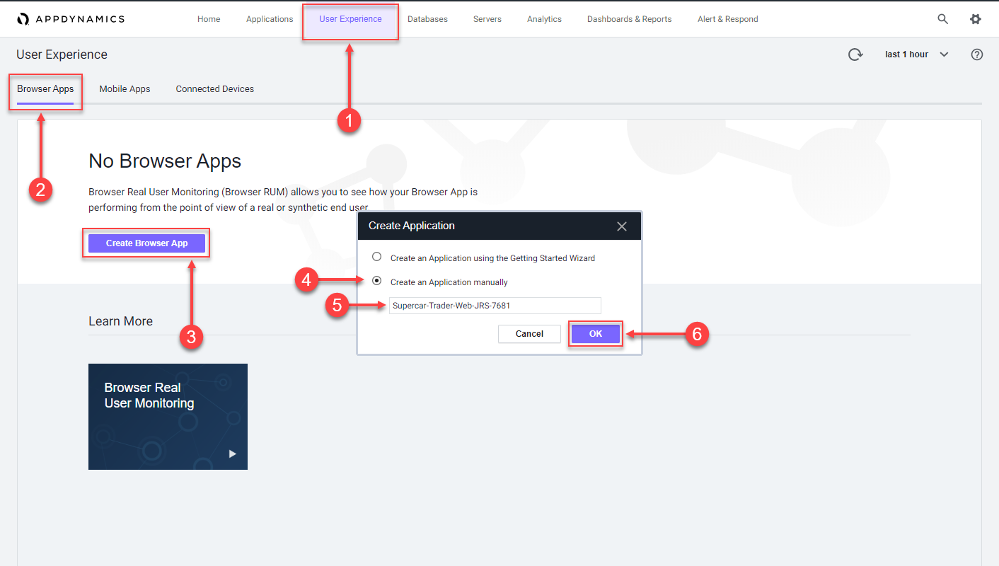
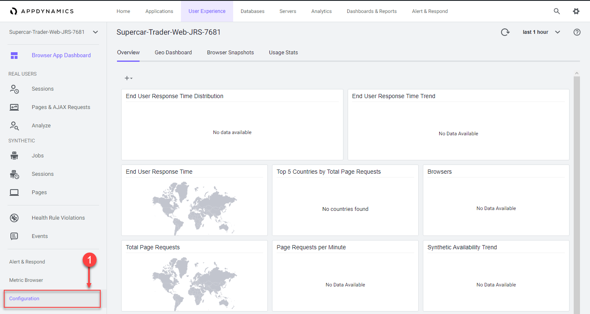
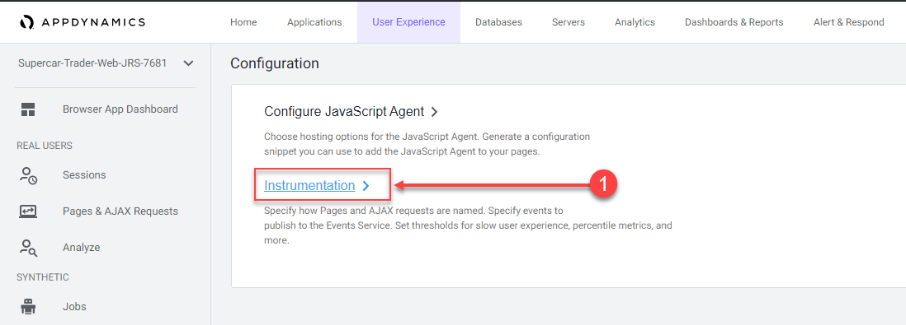
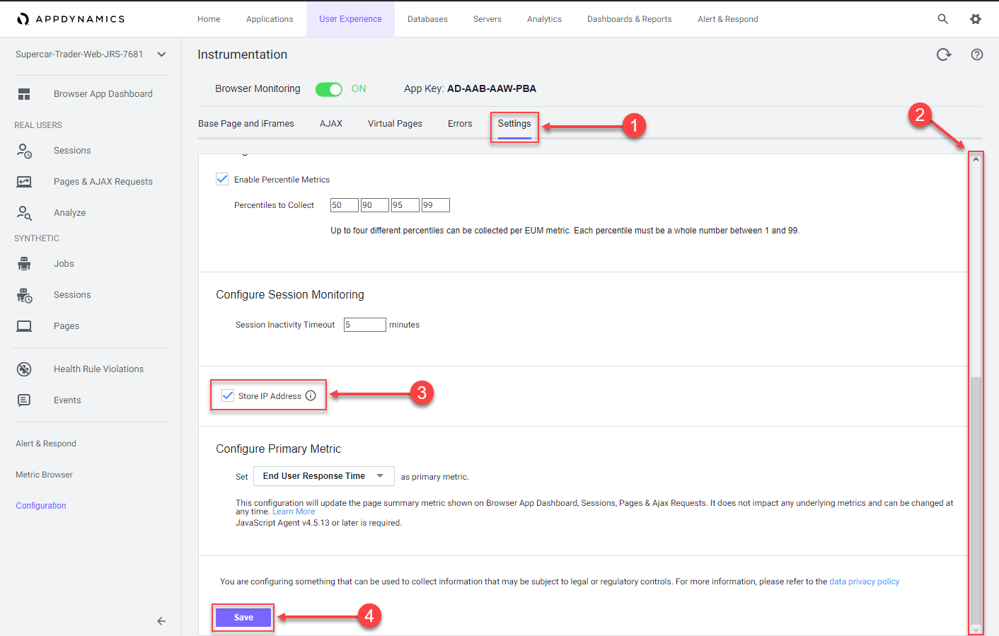

 Create a browser application in the Controller
=========================================================================

In this exercise you will need to do the following:

- Access your AppDynamics Controller from your web browser
- Create the Browser Application in the Controller
- Configure the Browser Application

In the example URL below, substitute the IP Address or fully qualified domain name of your Controller VM. 

Example Controller URL for browser:

```
http://IP_OR_FQDN_OF_HOST:8090/controller
```

### **1.** Access the controller login screen from your web browser
You should see the login page of the Controller like the image below.


Use the case sensative credentials below to login:

- Username = admin 
- Password = welcome1

<br>

### **2.** Create the Browser Application in the Controller

Use the following steps to create your new browser application.

**NOTE:** It is **very important** that you **create a unique name** for your browser application **in step five below**.  This lab uses a trial license from AppDynamics which has a constraint with the name of the browser application.

1. Click on the "User Experience" tab on the top menu
2. Click on the "Browser Apps" option under "User Experience"
3. Clcik on the "Create Browser App" button
4. Select the option to "Create an Application manually"
5. Type in **a unique name** for your browser application
   - **Format:** Supercar-Trader-Web-<your_initials_or_name>-<four_random_numbers>
   - **Example 1:** Supercar-Trader-Web-JFK-3179
   - **Example 2:** Supercar-Trader-Web-JohnSmith-0953
7. Click on the "OK" button

<br>



<br>

If you were not automatically taken to the "Browser App Dashboard" for the "Supercar-Trader-Web" application, you can get there by:

1. Clicking on the "Supercar-Trader-Web-###-####" application in the list
2. Click on the "Details" button


<br>

You should now see the "Browser App Dashboard" for the "Supercar-Trader-Web" application.  

1. Click on the "Configuration" tab on the left menu



<br>

You should now see two main options for configuration, "Configure JavaScript Agent" and "Instrumentation".

1. Click on the "Instrumentation" option



<br>

Change the default configuration to have the IP Address stored along with the data captured by the browser monitoring agent by following the steps below.

1. Click on the "Settings" option
2. Use the scroll bar on the right to scroll to the bottom of the screen
3. Check the "Store IP Address" check box
4. Click the "Save" button

You can read more about configuring the Controller UI for Browser RUM [here](https://docs.appdynamics.com/display/latest/Configure+the+Controller+UI+for+Browser+RUM)



<br>


[Lab setup](lab-exercise-00.md) | [1](lab-exercise-01.md), [2](lab-exercise-02.md), 3, [4](lab-exercise-04.md), [5](lab-exercise-05.md), [6](lab-exercise-06.md) | [Back](lab-exercise-02.md) | [Next](lab-exercise-04.md)
