 Monitor and troubleshoot Browser App issues - Part 1
=========================================================================

In this exercise you will need to do the following:

- Review the Browser Application Overview Dashboard
- Review the Browser Application Geo Dashboard
- Review the Browser Application Usage Stats Dashboard
- Navigate the Supercar-Trader application web pages


### **1.** Review the Browser Application Overview Dashboard

Navigate to the User Experience dashboard and drill into the browser application overview dashboard by following the steps below.

1. Click on the "User Experience" tab on the top menu
2. Click on the Supercar-Trader-Web application
3. Click the "Details" button

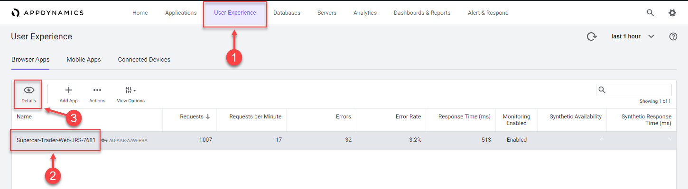

<br>

The Overview dashboard displays a set of configurable widgets. The default widgets contain multiple graphs and lists featuring common high-level indicators of application performance, including:

- End User Response Time Distribution
- End User Response Time Trend
- Total Page Requests by Geo
- End User Response Time by Geo
- Top 10 Browsers
- Top 10 Devices
- Page Requests per Minute
- Top 5 Pages by Total Requests
- Top 5 Countries by Total Page Requests

Explore the features of the dashboard described below.

1. Click on the "+" button to choose additional graphs and widgets to add to the dashboard
2. Click and drag the bottom right corner of any widget to resize it
3. Click on the area (seen outlined) in any widget to move and place it on the dashboard
4. Click on the title of any widget to drill into the detail dashboard
5. Click on the "X" in the top right corner of any widget to remove it from the dashboard

Any changes you make to the dashboard widget layout will automatically be saved.

You can read more about the Browser Application Overview dashboard [here](https://docs.appdynamics.com/display/latest/Browser+App+Dashboard#BrowserAppDashboard-overview)

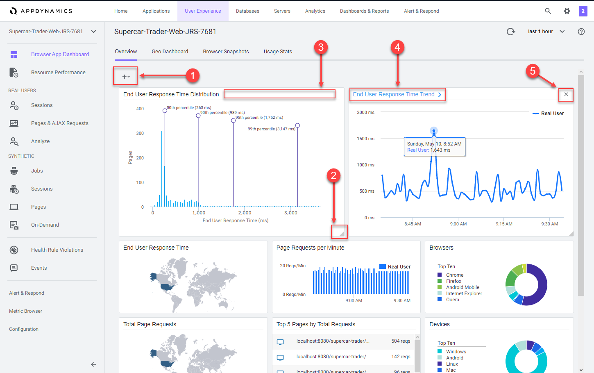

<br>

### **2.** Review the Browser Application Geo Dashboard

The Geo Dashboard displays key performance metrics by geographic location based on page loads.  The metrics displayed throughout the dashboard are for the region currently selected on the map or in the grid.  The Map view displays load circles with labels for countries that are in the key timing metrics given in the right panel. Some countries and regions, however, are only displayed in the grid view.

**NOTE:** Your Browser Application Geo dashboard in the lab will not be populated with as many countries or regions as seen in the image below.

Navigate to the Browser Application Geo dashboard and explore the features of the dashboard described below.

1. Click on the "Geo Dashboard" option
2. Click on one of the load circles to drill down to the region
3. Hover over one of the regions to show the region details
4. Use the zoom slider to adjust the zoom level
5. Click on the configuration button to explore the map options
6. Switch between the grid view and map view

You can read more about the Browser Application Geo dashboard [here](https://docs.appdynamics.com/display/latest/Browser+App+Dashboard#BrowserAppDashboard-geo)

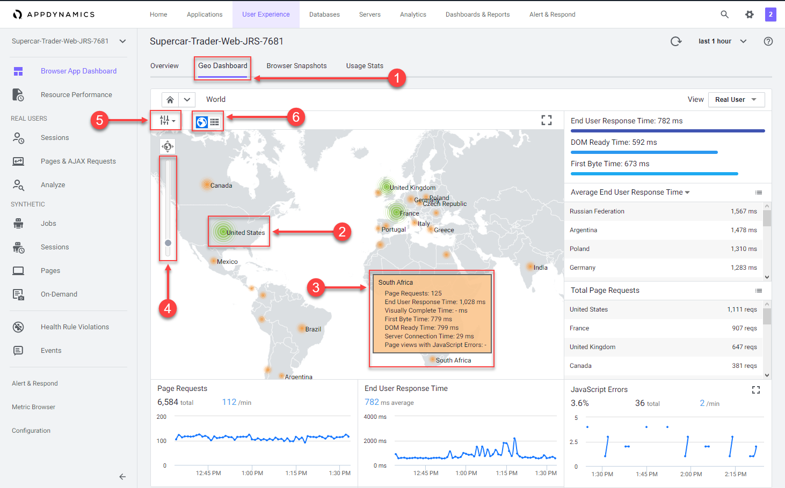

<br>

### **3.** Review the Browser Application Usage Stats Dashboard

The Browser Application Usage Stats dashboard presents aggregated page-load usage data based on your users browser type and device/platform.

The Browser Application Usage Stats dashboard helps you discover:

- The slowest browsers in terms of total end-user response time
- The slowest browsers to render the response page
- The browsers that most of your end users use
- The browsers that most of your end users use in a particular country or region

Navigate to the Browser Application Usage Stats dashboard and explore the features of the dashboard described below.

1. Click on the "Usage Stats" option
2. Click on "Show Versions" option
3. Look at the different browsers and versions by load
4. Hover over the sections in the pie chart to see the details

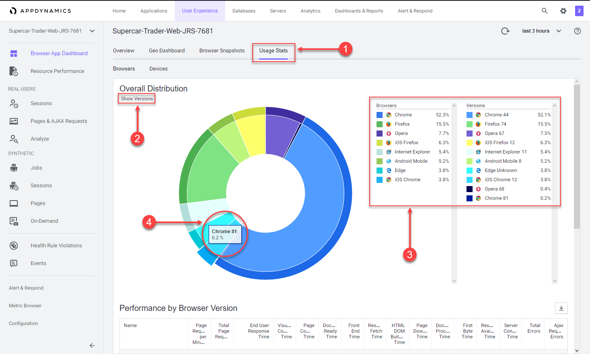

<br>

Use the steps below to explore more metrics by browser and version.

1. Use the scroll bar on the right to scroll to the bottom of the page
2. Explore the available metrics by browser and version
3. Explore the available metrics by country

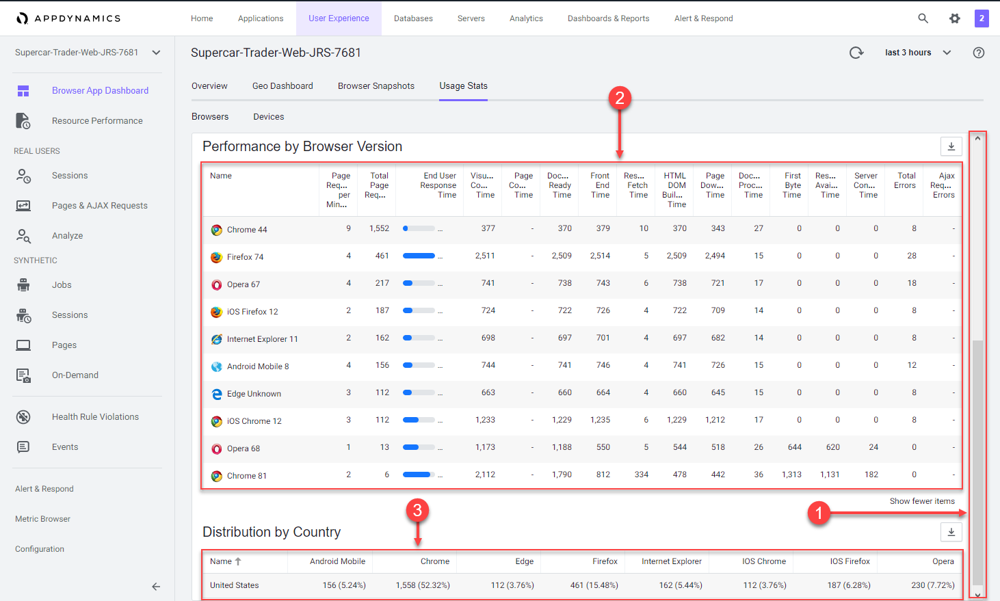

<br>

Navigate to the Devices dashboard and explore the features of the dashboard described below.

1. Click on the "Devices" option
2. Look at the load by device break out
3. Hover over the sections in the pie chart to see the details
4. Explore the available performance metrics by device

You can read more about the Browser Application Geo dashboard [here](https://docs.appdynamics.com/display/latest/Browser+App+Dashboard#BrowserAppDashboard-usage-stats)

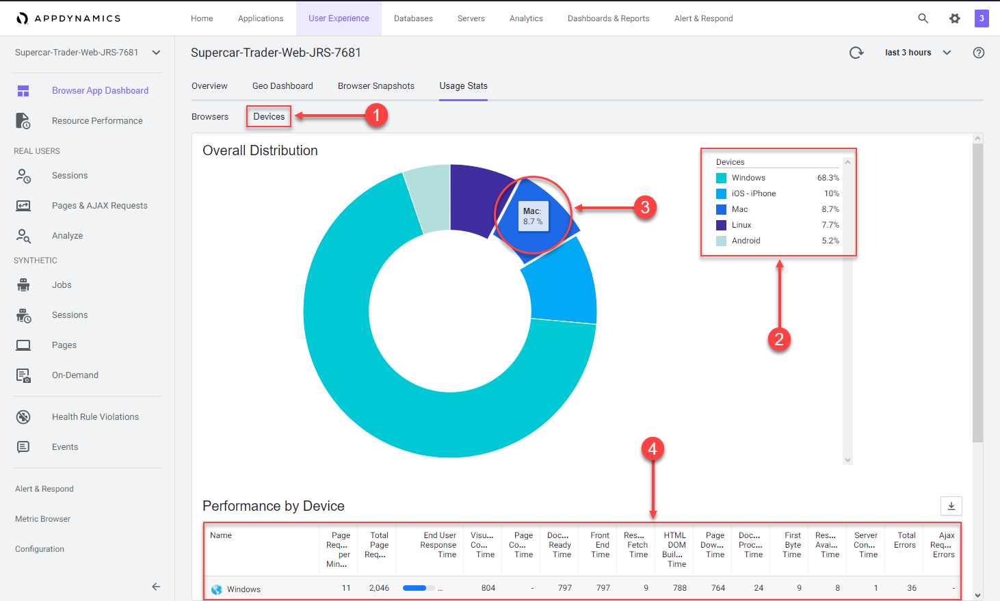

<br>

### **4.** Navigate the Supercar-Trader application web pages

Now that you have the Browser Real User Monitoring agent configured and explored the first series of features, let's generate some additional load and record your unique browser session by navigating the web pages of the Supercar-Trader application.

Start by opening the main page of the app with your web browser.  In the example URL below, substitute the IP Address or fully qualified domain name of your Application VM. 

Example Application URL for browser:

```
http://IP_OR_FQDN_OF_HOST:8080/Supercar-Trader/home.do
```

You should see the home page of the application like the image below.

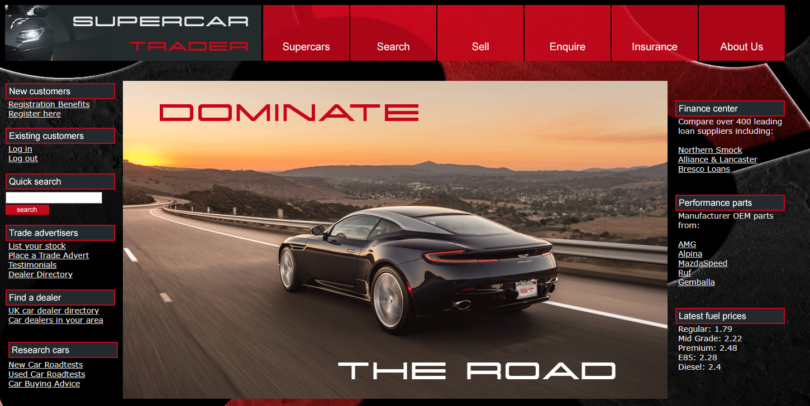

<br>

Open the listing of available Ferraris by following the steps below.

1. Click on the "Supercars" tab on the top menu
2. Click on the Ferrari logo

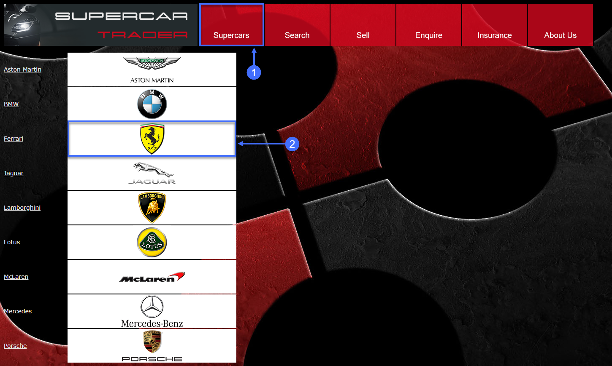

<br>

You should see the list of Ferraris like the image below.

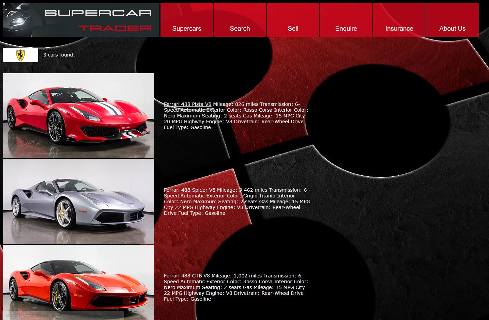

<br>

Click on the image of the first Ferrari and follow the steps below.

1. Click on the "view enquiries" button
2. Click on the "enquire" button

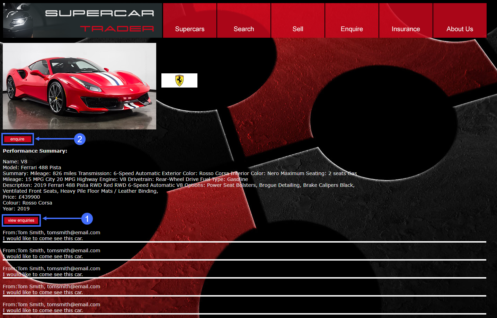

<br>

Submit an enquiry for the car by following the steps below.

1. Fill out the fields on the enquiry form with appropriate data
2. Click on the "submit" button

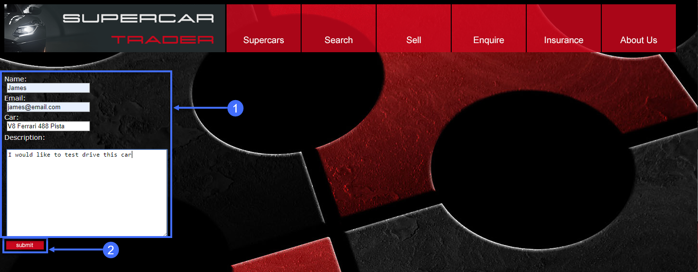

<br>

Search for cars and continue browsing the site by following the steps below.

1. Click on the "Search" tab on the top menu
2. Type the letter A into the search box and click the "search" button
3. Click on the remaining tabs to explore the web site

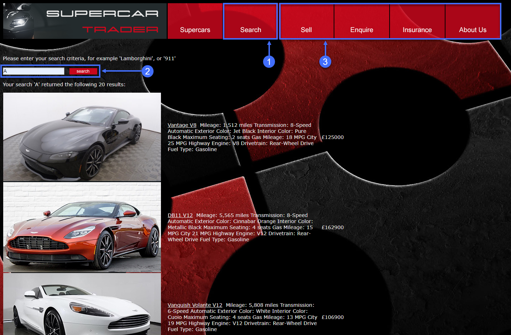

<br>

[Lab setup](lab-exercise-00.md) | [1](lab-exercise-01.md), [2](lab-exercise-02.md), [3](lab-exercise-03.md), [4](lab-exercise-04.md), 5, [6](lab-exercise-06.md) | [Back](lab-exercise-04.md) | [Next](lab-exercise-06.md)
