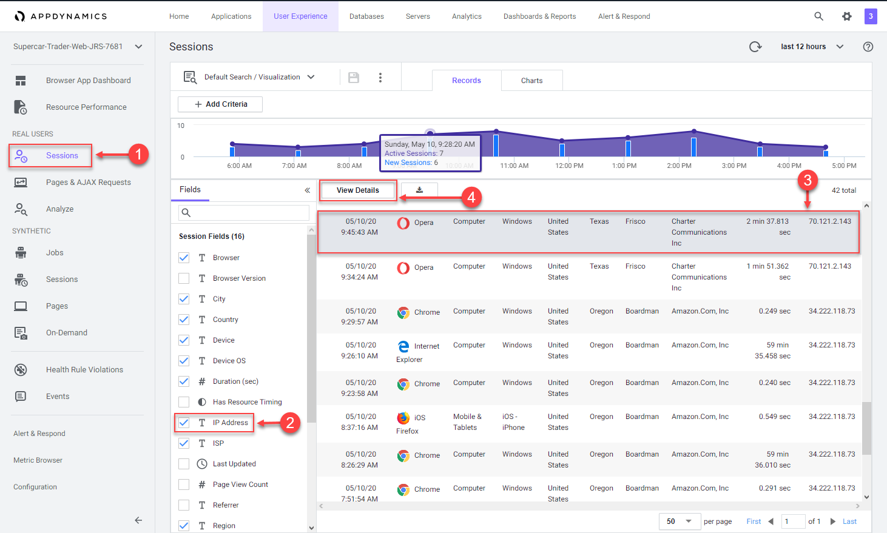
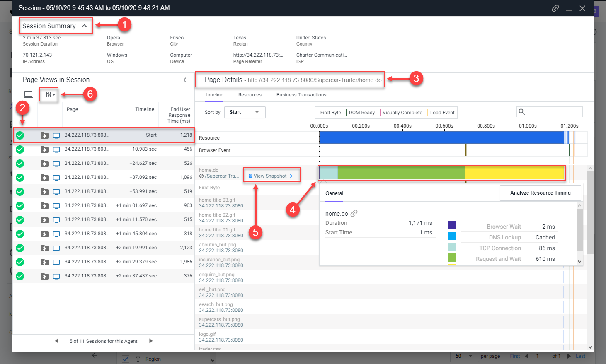

 Monitor and troubleshoot Browser App issues - Part 2
=========================================================================

In this exercise you will need to do the following:

- Review the Browser Session you created
- Review the Pages & AJAX Requests Dashboard
- Review the Dashboard for a specific Base Page
- Troublshoot a Browser Snapshot

### **1.** Review the Browser Session you created

You can think of sessions as a time-based context to analyze a user's experience interacting with an application. By examining browser sessions, you can understand how your applications are performing and how users are interacting with them. This enables you to better manage and improve your application, whether that means modifying the UI or optimizing performance on the server side.

Navigate to the Sessions dashboard and find the browser session you created in the last exercise from navigating the pages of the web application. Follow the steps below.

**NOTE:** You may need to wait ten mintues after you hit the last page in the web application to see your browser session show up in the sessions list.

1. Click on the "Sessions" tab on the left menu
2. Check the "IP Address" in the Session Fields list
3. Find the session you created (find it by your IP Address)
4. Click on your session, then click the "View Details" button

 

Once you find and open the session you created, follow the steps below to explore the diffrent features of the session view.

**NOTE:** Your session may not have a "View Snapshot" link in any of the pages (as seen in step five).  You will find a session that has one to explore later in this exercise.

1. Click on the "Session Summary" link to view the summary data
2. When you click on a page listed on the left, you see the details of that page on the right
3. You can always see the full name of the page you have selected in the left list here
4. Click on a horizontal blue bar in the waterfall view to show the details of that item
5. Some pages may have a link to a correlated snapshot that was captured on the server side
6. Click on the configuration icon to change the columns shown in the pages list

You can read more about the Browser RUM Sessions [here](https://docs.appdynamics.com/display/latest/Browser+RUM+Sessions)

 

 

You have now completed this lab!

[Lab setup](lab-exercise-00.md) | [1](lab-exercise-01.md), [2](lab-exercise-02.md), [3](lab-exercise-03.md), [4](lab-exercise-04.md), [5](lab-exercise-05.md), 6 | [Back](lab-exercise-05.md) | Next
