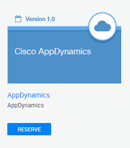

 Reserve Your Lab Sandbox Environment
=========================================================================

## Introduction

AppDynamics is a full-stack performance monitoring solution for your critical business applications that offers the following features:

* Consistent end-to-end application monitoring, regardless of environment, traditional, hybrid, or cloud-native.
* Accelerated cloud migration and enterprise-grade, end-to-end insights for your applications regardless of where they are deployed.
* Unified monitoring that enables you to quickly resolve performance issues before they become business problems, with three clicks to root cause.

You can optimize the total cost of ownership by leveraging existing personnel, processes, and training on AppDynamics platform for traditional, cloud, or hybrid deployments.

## Objectives

Before you can start working on the AppDynamics labs, you need to reserve a DevNet Sandbox.  The Sandbox environment for the labs will have two virtual machines.

* The first virtual machine hosts the AppDynamics Controller.
* The second virtual machine hosts the Supercar Trader application. This application is used in the labs and the VM is the host where you will install the AppDynamics agents.

After installing the AppDynamics agents, you will access the AppDynamics Controller to monitor the application performance and troubleshoot issues in the application that are impacting end users.

## Prerequisites

To run this lab, you need to reserve time on the Cisco AppDynamics Sandbox from
[DevNet Sandbox Remote Labs](https://devnetsandbox.cisco.com/RM/Diagram/Index/9e056219-ab84-4741-9485-de3d3446caf2?diagramType=Topology).



For more information about the DevNet Sandbox visit: https://developer.cisco.com/site/sandbox/.

After you receive an email confirming your sandbox reservation:

1. Connect to the sandbox via VPN, using the instructions, network address, and credentials in your reservation email.
2. After you connect successfully, use your preferred terminal program to SSH to the **Application VM** with ```centos/cisco123``` credentials:

```
ssh cisco@10.10.20.10
```

<br>

Lab setup | [1](lab-exercise-01.md), [2](lab-exercise-02.md), [3](lab-exercise-03.md), [4](lab-exercise-04.md), [5](lab-exercise-05.md), [6](lab-exercise-06.md), [7](lab-exercise-07.md) | Back | [Next](lab-exercise-01.md)
