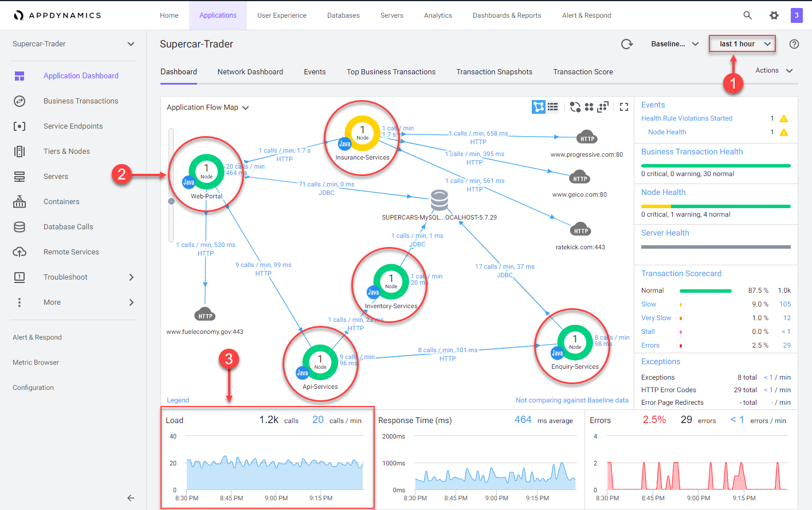
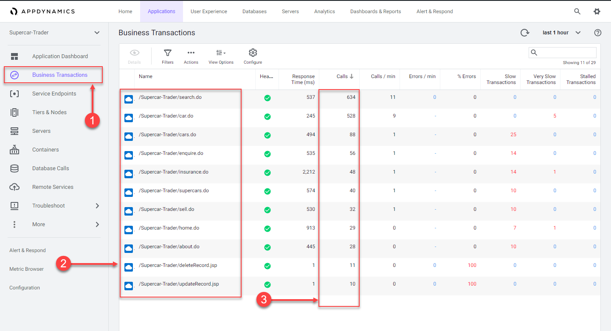
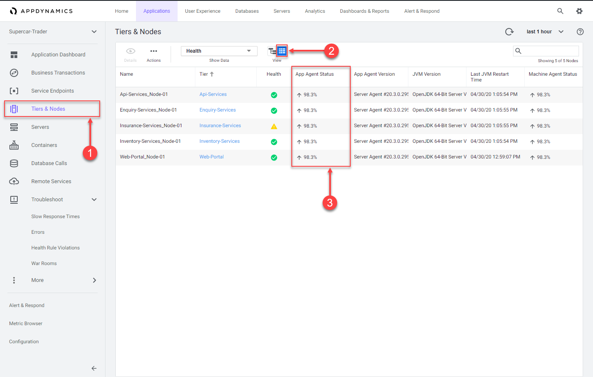
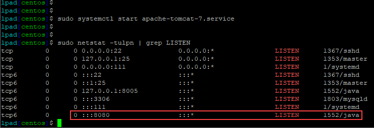
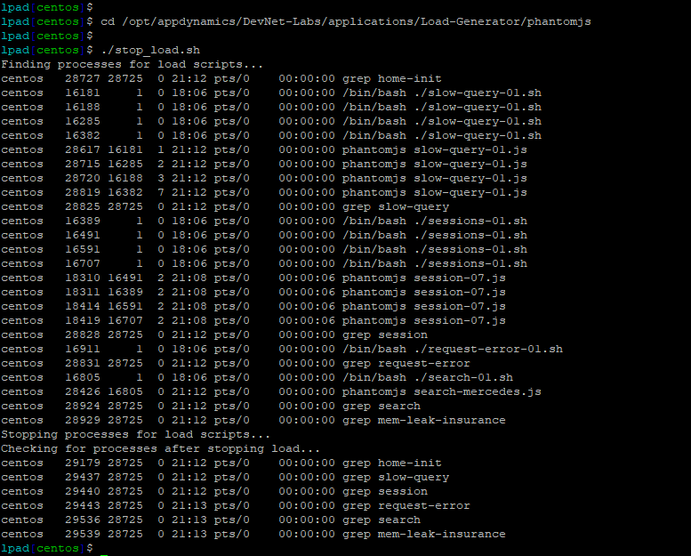
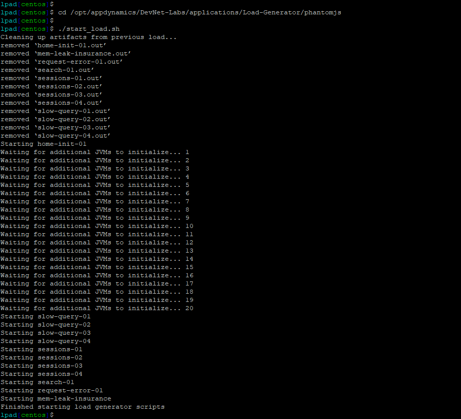

 Check the Lab Prerequisites
=========================================================================

In this exercise you will need to do the following:

- Access your AppDynamics Controller from your web browser
- Verify transaction load to the application
- Restart the application and transaction load if needed

In the example URL below, substitute the IP Address or fully qualified domain name of your Controller VM. 

Example Controller URL for browser:

```
http://IP_OR_FQDN_OF_HOST:8090/controller
```

### **1.** Access the controller login screen from your web browser
You should see the login page of the Controller like the image below.


Use the case sensative credentials below to login:

- Username = admin 
- Password = welcome1

<br>

### **2.** Verify transaction load to the application

#### Check the application flow map:

1. Select the "last 1 hour" time frame
2. Verify you see the five different Tiers on the flow map
3. Verify there has been consistent load over the last 1 hour

<br>



<br>

#### Check the list of business transactions:

1. Click on the "Business Transactions" option on the left menu
2. Verify you see the eleven business transactions seen below
3. Verify that they have some number of calls during the last hour

**NOTE:** If you don't see the "Calls" column, you can click on the "View Options" toolbar button to show that column.

<br>



<br>

#### Check the agent status for the Nodes:

1. Click on the "Tiers & Nodes" option on the left menu
2. Click on the "Grid View" button
3. Verify that the "App Agent Status" for each Node is greater than 90% during the last hour

<br>




### **3.** Restart the application and transaction load if needed

If any of the checks you performed in the previous steps could not be verified, SSH into your "Application VM" and follow the steps below to restart the application and transaction load.

#### Restart Apache Tomcat:

Use the command below to stop the running instance of Apache Tomcat.

```
sudo systemctl stop apache-tomcat-7.service
```

Wait for one minute then use the command below to start Apache Tomcat.

```
sudo systemctl start apache-tomcat-7.service
```

Wait for two minutes and use the command below to ensure Apache Tomcat is running on port 8080.

```
sudo netstat -tulpn | grep LISTEN
```
You should see output like the image below showing that port 8080 is in use by Apache Tomcat.




#### Restart the application transaction load:

Use the commands below to stop the load generation for the application.

```
su centos

cd /opt/appdynamics/DevNet-Labs/applications/Load-Generator/phantomjs

./stop_load.sh
```

You should see output like the image below.



<br>

Use the commands below to start the load generation for the application.

```
cd /opt/appdynamics/DevNet-Labs/applications/Load-Generator/phantomjs

./start_load.sh
```

You should see output like the image below.




<br>

[Lab setup](lab-exercise-00.md) | [1](lab-exercise-01.md), 2, [3](lab-exercise-03.md), [4](lab-exercise-04.md), [5](lab-exercise-05.md), [6](lab-exercise-06.md) | [Back](lab-exercise-01.md) | [Next](lab-exercise-03.md)
