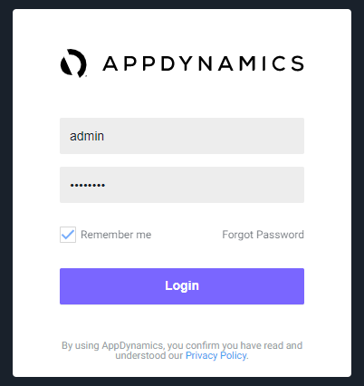
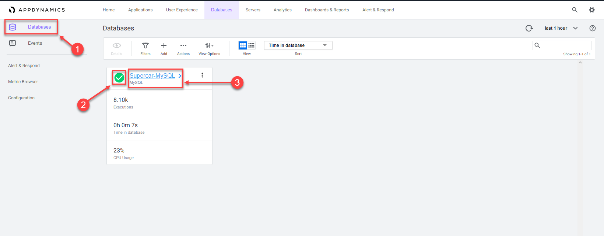

 Configure a Database Collector in the Controller
=========================================================================

The Database Agent Collector is the process that runs within the Database Agent to collect performance metrics about your database instances and database servers. One collector collects metrics for one database instance. Multiple collectors can run in one Database Agent.

In this exercise you will need to do the following:

- Access your AppDynamics Controller from your web browser
- Configure a Database Collector in the Controller
- Confirm the Database Collector is collecting data

In the example URL below, substitute the IP Address or fully qualified domain name of your Controller VM. 

Example Controller URL for browser:

```
http://IP_OR_FQDN_OF_HOST:8090/controller
```

### **1.** Access the controller login screen from your web browser
You should see the login page of the Controller like the image below.



Use the case sensative credentials below to login:

- Username = admin 
- Password = welcome1

<br>

### **2.** Configure a Database Collector in the Controller

Use the following steps to change the settings for the query literals and navigate to the collectors configuration.

1. Click on the "Databases" tab on the top menu
2. Click on the "Configuration" tab on the left
3. Uncheck the checkbox for "Remove literals from the queries"
4. Click the "OK" button
5. Click on the "Collectors" option


<br>

Use the following steps to configure a new Database collector.

1. Click on the "Add" button on the toolbar
2. Select "MySQL" for the database type
3. Select "DBMon-Lab-Agent" for the database agent
4. Name = Supercar-MySQL
5. Hostname or IP Address = localhost
6. Listener Port = 3306
7. Username = root
8. Password = Welcome1!
9. Check the "Logging Enabled" checkbox
10. Check the "Monitor Operating System" checkbox
11. Select "Linux" as the operating system
12. SSH Port = 22
13. Username = centos
14. Passord = cisco123
15. Click on the "OK" button to save the collector

**NOTE:** The passwords in the steps above are case sensative.


<br>

### **3.** Confirm the Database Collector is collecting data

Wait for ten minutes to allow the collector to run and submit data, then use the following steps to verify the database collector is connecting to the database and collecting database metrics.

1. Click on the "Databases" tab on the left menu
2. Ensure the status is green and there are no errors shown
3. Click on the "Supercar-MySQL" link to drill into the database

**Note** It may take up to 18 minutes from the time you configure your collector to see the "Top 10 SQL Wait States" and any queries on the "Queries" tab.

You can read more about configuring Database Collectors [here](https://docs.appdynamics.com/display/latest/Add+Database+Collectors) and [here](https://docs.appdynamics.com/display/latest/Configure+MySQL+Collectors)




<br>

[Lab setup](lab-exercise-00.md) | [1](lab-exercise-01.md), [2](lab-exercise-02.md), [3](lab-exercise-03.md), [4](lab-exercise-04.md), 5, [6](lab-exercise-06.md), [7](lab-exercise-07.md) | [Back](lab-exercise-04.md) | [Next](lab-exercise-06.md)

