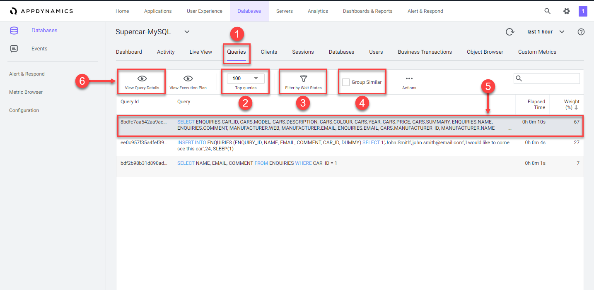
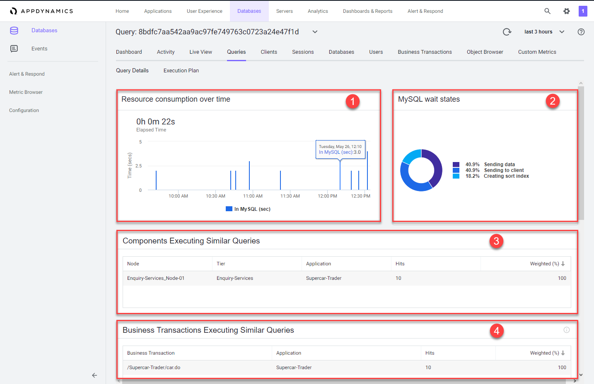
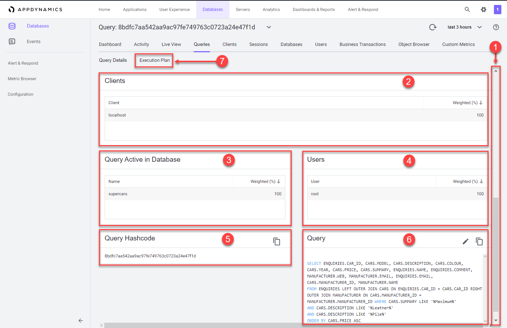
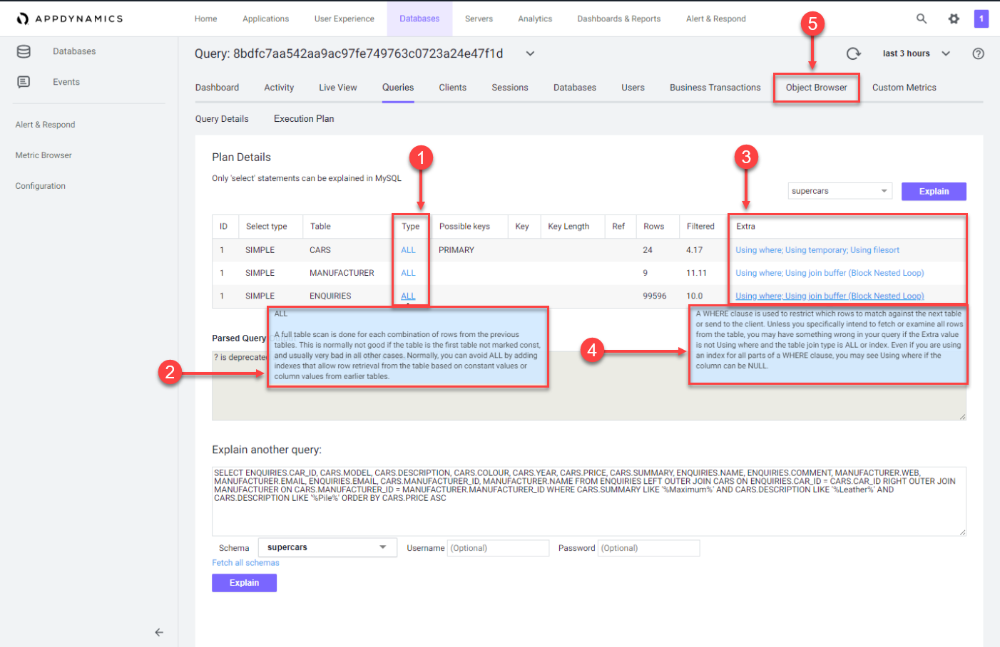
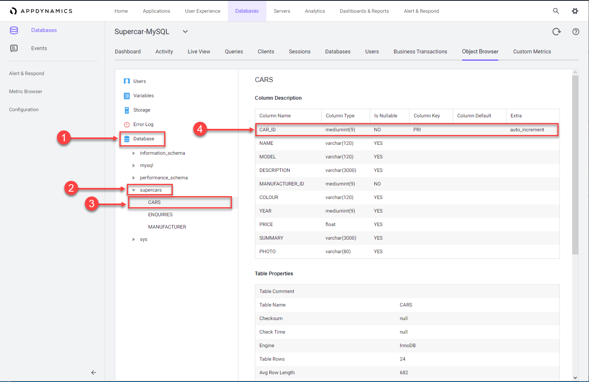
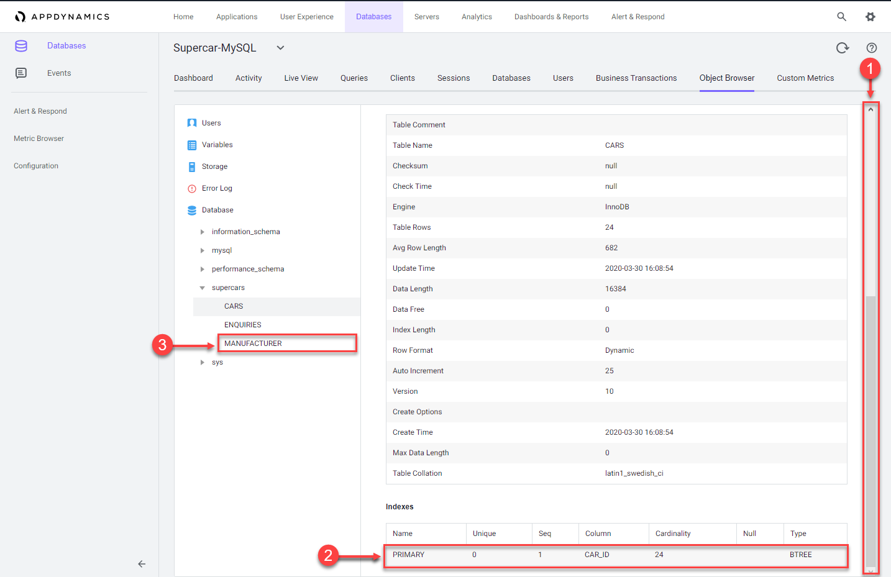
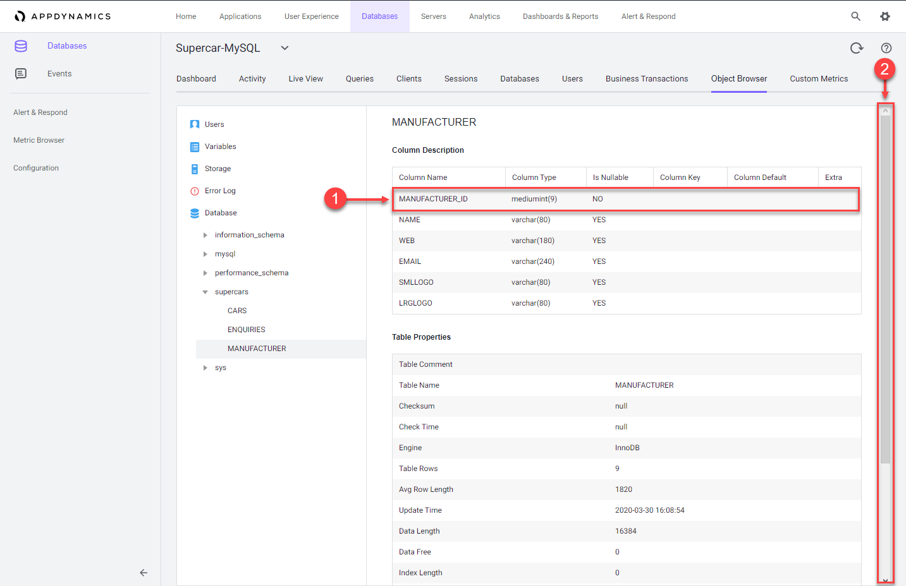

 Monitor and troubleshoot Database issues - Part 2
=========================================================================

In this exercise you will need to do the following:

- Review the Queries Dashboard
- Review the details of an expensive query
- Troublshoot an expensive query

### **1.** Review the Queries Dashboard

The Queries window displays the SQL statements and stored procedures that consume the most time in the database. You can compare the query weights to other metrics such as SQL wait times to determine SQL that requires tuning.

1. Click on the "Queries" tab to view the queries window
2. Click on the "Top Queries" dropdown to display the top 5, 10, 100 or 200 queries
3. Click "Filter by Wait States" button to choose wait states to filter the Query list by
4. Check the "Group Similar" box to group together queries with the same syntax
5. Click on the query that shows the largest "Weight (%)" used
6. Click on the "View Query Details" button to drill into the query details

You can read more about the Database Queries dashboard [here](https://docs.appdynamics.com/display/latest/Database+Queries+Window)

 

### **2.** Review the details of an expensive query

Once you have identified the statements on the Database Queries window that are spending the most amount of time in the database, you can dig down deeper for details that can help you tune those SQL statements. The database instance Query Details window displays details about the query selected on the Database Queries window.

1. Resource consumption over time shows the amount of time the query spent in the database using resources, the number of executions, and the amount of CPU time consumed.
2. Wait states are the activities that contribute to the time it takes the database to service the selected SQL statement. The wait states consuming the most time may point to performance bottlenecks.
3. Components Executing Similar Queries displays the Nodes that execute queries similar to this query.
4. Business Transactions Executing Similar Queries displays the Java business transactions that execute queries similar to this query.

 

1. Use the outer scroll bar on the right to scroll down.
2. Clients shows the machines that executed the selected SQL statement and the percentage of the total time required to execute the statement performed by each machine.
3. Query Active in Database shows the schemas that have been accessed by this SQL.
4. Users shows the users that executed this query.
5. Query Hashcode shows the unique ID for the query that allows the database server to more quickly locate this SQL statement in the cache.
6. Query shows you the entire syntax of the selected SQL statement. You can click the pencil icon in the top right corner of the Query card to edit the query name so that it is easy to identify.
7. Click on the "Execution Plan" option to see the query execution plan window.

You can read more about the Database Query Details dashboard [here](https://docs.appdynamics.com/display/latest/Database+Query+Details+Window)

 

### **3.** Troublshoot an expensive query

The Database Query Execution Plan window can help you to determine the most efficient execution plan for your queries. Once you've discovered a potentially problematic query, you can run the EXPLAIN PLAN statement to check the execution plan that the database created. A query's execution plan reveals whether the query is optimizing its use of indexes and executing efficiently. This information is useful for troubleshooting queries that are executing slowly.

1. Notice that the join type in the "Type" column is ALL for each table.
2. Hover over one of the join types to see the description for the join type.
3. Examine the entries in the "Extra" column.
4. Hover over each of the entries to see the description for the entry.
   - The descriptions in the Explain Plan Details point to the use of full table scans across all three tables in the query.
   - Let's investigate the indexes on the table using the Obect Browser next.
5. Click on the "Object Browser" option to view details of the schema for the tables

You can read more about the Database Query Execution Plan dashboard [here](https://docs.appdynamics.com/display/latest/Database+Query+Execution+Plan+Window)

 

1. Click on the "Database" option on the left.
2. Click on the "supercars" schema to expand the list of tables.
3. Click on the "CARS" table to see the details of the table.
4. You can see that the "CAR_ID" column is defined as the primary key

 

1. Use the outer scroll bar to scroll down the page.
2. Notice the primary key index defined in the table.
3. Click on the "MANUFACTURER" table to view its details.

 

1. Notice the "MANUFACTURER_ID" column is not defined as a primary key.
2. Scroll down the page to see there are no indexes defined for the table.

The expensive query you looked at is joining across three tables and could benefit from an index for each column in each join.  The "MANUFACTURER_ID" column needs an index created for it to improve the performance of any queries on the table.

 

You have now completed this lab!

[Lab setup](lab-exercise-00.md) | [1](lab-exercise-01.md), [2](lab-exercise-02.md), [3](lab-exercise-03.md), [4](lab-exercise-04.md), [5](lab-exercise-05.md), [6](lab-exercise-06.md), 7 | [Back](lab-exercise-06.md) | Next
